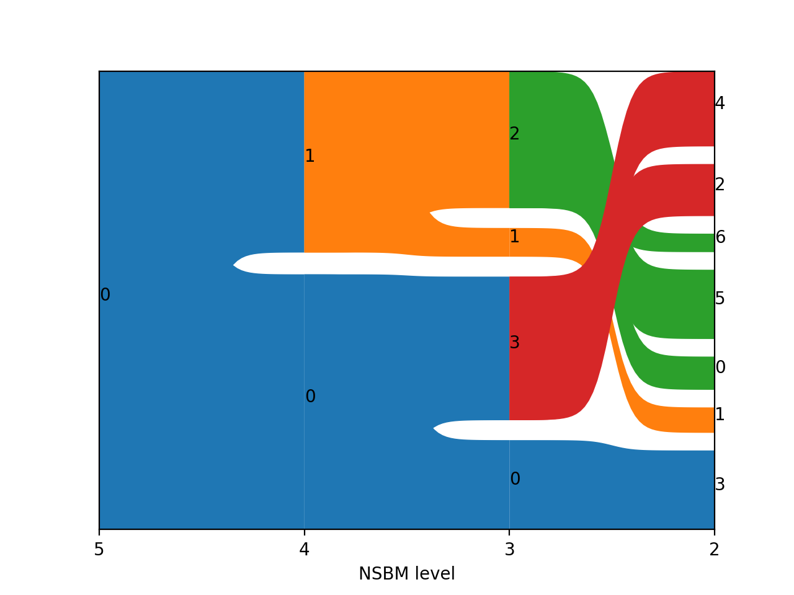

# Advanced usage

This page explains some advanced usage options for scNSBM

## Understanding NSBM

Foo bar baz

## Plotting

### Alluvial Plots

scNSBM provides an interface to `graph-tool` to infer Nested Stochastic Block Models from single cell data in `scanpy`. Once models are built, data are partitioned in multiple groups, linked together in hierarchical way. In order to represent a hierarchy, scNSBM implements a simple plot function that represents data using alluvial plots:

```python
adata = scnsbm.io.read('adata')
scnsbm.pl.alluvial(adata)
```


This function will plot all levels in hierarchy by default. As many level are uninformative, they can be excluded from the plot

```python
adata = scnsbm.io.read('adata')
scnsbm.pl.alluvial(adata, level_end=5)
```


Leaf levels can be also excluded

```python
adata = scnsbm.io.read('adata')
scnsbm.pl.alluvial(adata, level_end=5, level_start=2)               
```


### Extending `sc.tl.draw_grap()`

`graph-tools` has built-in functionalities to plot graphs. Some of these have been implemented into scNSBM using a syntax compatibile with `scanpy`'s functions. Note that Fruchterman-Reingold spring-block layout is already implemented into `scanpy`, and it gives the same output. However, scNSBM allows to seed the plot using the graph tree.

