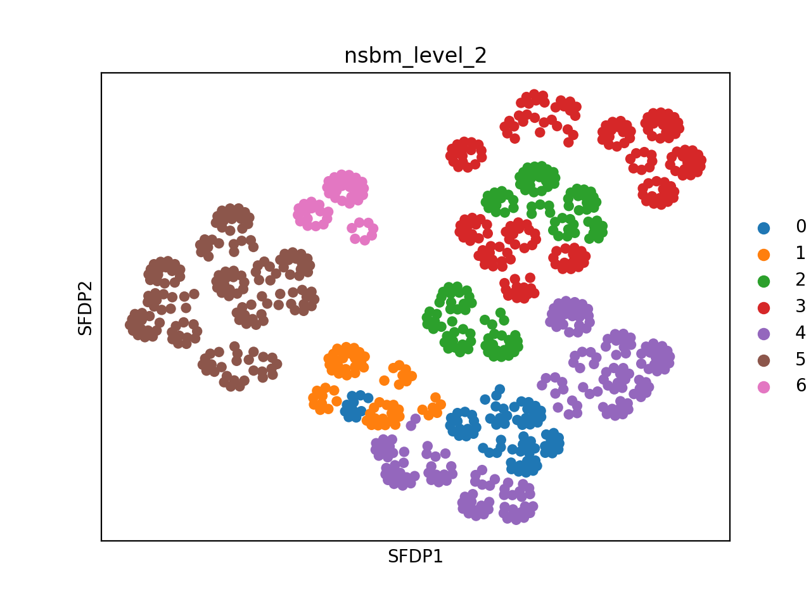

# Advanced usage

This page explains some advanced usage options for `schist`. 

- [Understanding NSBM](#Understanding-NSBM)
- [Plotting](#Plotting)

## Understanding NSBM

`schist` is based on Nested Stochastic Block Models (NSBM), a generative process based on the notion of group of nodes. Here, we use NSBM to cluster cells in scRNA-seq experiments.

### Bayesian approach
Cell to cell relations are commonly represented as a neighborhood graph (typically KNN or  SNN), cell groups are identified as graph communities, this step is usually performed maximising graph modularity. In `schist`, instead, partitioning is performed maximising the  Bayesian posterior probability **P(b|A)**, that is the likehood of generating a network _A_ with a partition _b_ and it is obtained according to 


Where **P(A|θ,b)** is the probability of obtaining the network _A_ given the partition _b_ and additional parameters _θ_; **P(θ,b)** is the probability of occurrence of the partition _b_ having observed the netwok _A_; **P(A)** is the “model evidence” and it is the same for all possible partitions. Refer to the excellent [`graph-tool` documentation](https://graph-tool.skewed.de/static/doc/demos/inference/inference.html) for more details. Note that maximising this quantity is equivalent to minimizing the entropy


The nested model introduces a hierarchy of priors used to infer the optimal recursive grouping of single cell groups. If you are familiar with Leiden or Louvain methods to find cell groups, you may think at this multilevel approach as a multiresolution one, except that it is not. Here, not only the cell groups at each hierarchy level are found maximising the equation above, but the hierarchy itself (hence the groups of groups) is part of the model.
Since there may be more than one fit with similar probability, `schist` uses the `graph-tool` routines to apply a Markov chain Monte Carlo sampling of the posterior distribution aiming to converge to the best model. 
One of the main limitations of `schist` is that it requires significantly more time than any other state of the art approach to identify cell groups. This cost comes with the benefit that it is possible to choose between different parameters according to the likelihood of a partition set to be found over a network. 

### Fast model vs standard approach

In the standard approach, the model is initialized by minimizing the description length (entropy). This requires extra time but, in general, returns better results. It is possible to achieve good results with lower memory footprint and in shorter times settting `fast_model`:

```python
nested_model(adata, fast_model=True)
```

This will seed the model with a dummy partition scheme, then a greedy merge-split MCMC will explore solutions until it converges.

### Marginals

When using the following invocation 

```python
nested_model(adata, collect_marginals=True, equilibrate=True)
```

an additional step (with fixed number of iterations) is added to execution. During this step, `schist` collects the probability of having a certain number of groups for each level of the hierarchy. These are stored into `adata.uns['nsbm']['group_marginals']`:

```python
level = 2
S = adata.uns['nsbm']['group_marginals'][level].sum()
p = adata.uns['nsbm']['group_marginals'][level] / S
ng = range(1, len(p) + 1)
bar(ng, p)
xticks(ng)
xlabel('Number of groups')
ylabel('Probability')
title(f'Group marginals for level {level}')
```


Prior to version 0.3.4, this option would have collected posterior probabilities of cells to belong to a certain group. Since this quantity is interesting and it would have required a long time to compute, we'd rather calculate variation of global entropy by moving all cells to all identified groups and transform that into a probaility, which is now stored into `adata.uns['nsbm']['cell_affinity']`. Here, a dictionary keyed with NSBM levels counts the times a cell has been successfully moved to a group. These probabilities can be efficiently used as covariates when looking for marker genes, this approach will weight the belief that a cell belongs to a group. We have prepared a [notebook](https://github.com/dawe/schist-notebooks/blob/master/Cell_Marginals.ipynb) showing an example. 

## Plotting

### Alluvial Plots

`schist` provides an interface to `graph-tool` to infer Nested Stochastic Block Models from single cell data in `scanpy`. Once models are built, data are partitioned in multiple groups, linked together in hierarchical way. In order to represent a hierarchy, `schist` implements a simple plot function that represents data using alluvial plots:

```python
adata = schist.io.read('adata')
schist.pl.alluvial(adata)
```


This function will plot all levels in hierarchy by default. As many level are uninformative, they can be excluded from the plot

```python
adata = schist.io.read('adata')
schist.pl.alluvial(adata, level_end=5)
```


Leaf levels can be also excluded

```python
adata = schist.io.read('adata')
schist.pl.alluvial(adata, level_end=5, level_start=2)               
```


### Extending `sc.tl.draw_graph()`

`graph-tools` has built-in functionalities to plot graphs. Some of these have been implemented into `schist` using a syntax compatibile with `scanpy`'s functions. Note that Fruchterman-Reingold spring-block layout is already implemented into `scanpy`, and it gives the same output. 

```python
adata = schist.io.read('adata')
schist.tl.draw_graph(adata, layout='fr') 
sc.pl.draw_graph(adata, layout='fr', color='nsbm_level_2', legend_loc='on data')     
```


However, `schist` allows to seed the plot using the graph tree.

```python
adata = schist.io.read('adata')
schist.tl.draw_graph(adata, layout='fr', use_tree=True) 
sc.pl.draw_graph(adata, layout='fr', color='nsbm_level_2')
```


Default layout is SFDP spring-block layout

```python
adata = schist.io.read('adata')
schist.tl.draw_graph(adata)
sc.pl.draw_graph(adata, layout='sfdp', color='nsbm_level_2', legend_loc='on data')     
```


With tree information

```python
adata = schist.io.read('adata')
schist.tl.draw_graph(adata, use_tree=True)
sc.pl.draw_graph(adata, layout='sfdp', color='nsbm_level_2')     
```


