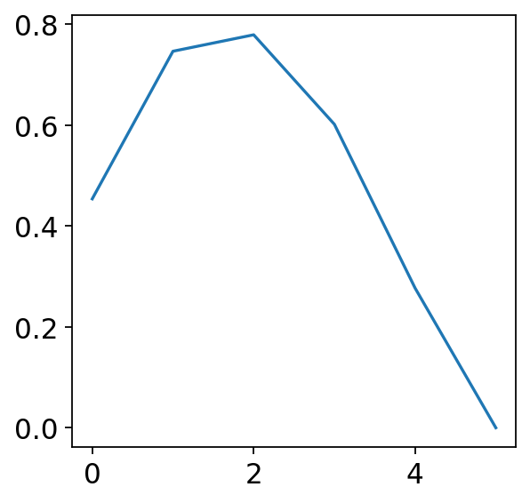
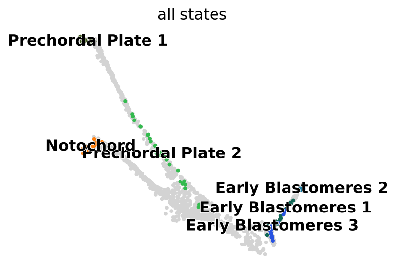

.. _cellrank_integration:

=========================
Integration with cellrank
=========================

In this notebook we introduce the interoperability between ``schist`` and ``cellrank``. We will use one of the examples from ``cellrank`` (Zebrafish). Note that the number of clusters that will be generated by ``schist`` won't necessarily be conserved if you run this same code. Note also that this notebook is using ``cellrank`` version 2.

First load some libraries that will be required.

.. code:: python

    import cellrank as cr
    import scanpy as sc
    import scvelo as scv
    import schist as scs
    import numpy as np
    import pandas as pd
    import matplotlib as mpl
    import matplotlib.pyplot as plt
    from matplotlib.pyplot import *
    import scipy.stats as st
    import scipy.spatial as ssp
    import graph_tool as gt
    import seaborn as sns
    sc.set_figure_params()
    rcParams['axes.grid'] = False
    %matplotlib inline

We first download the Zebrafish dataset and perform some preprocessing as previously showed on ``cellrank`` tutorials

.. code:: python

    adata = cr.datasets.zebrafish()
    sc.pp.filter_genes(adata, min_cells=10)
    scv.pp.normalize_per_cell(adata)
    sc.pp.log1p(adata)
    
    sc.pp.highly_variable_genes(adata)
    
    adata.layers["spliced"] = adata.X
    adata.layers["unspliced"] = adata.X
    n_neighbors = int(np.sqrt(adata.shape[0]/4))
    scv.pp.moments(adata, n_pcs=30, n_neighbors=n_neighbors)

We then run a nested model in ``schist`` as usual. Plotting the modularity profile allows us to identify the most likely level of interest, level 2 in this case.

.. code:: python

    scs.inference.nested_model(adata, max_iter = np.inf)
    
    plot(adata.uns['schist']['nsbm']['stats']['modularity'])

Remove the given color map for developmental stages and plot the hierarchy along with it.

.. code:: python

    CC = adata.uns.pop('Stage_colors')
    sc.pl.embedding(adata, color=['Stage', 'nsbm_level_2',
                                 'nsbm_level_3', 'nsbm_level_4'], 
                    basis='X_force_directed', ncols=2, 
                   legend_loc='on data', frameon=False)

We already appreciate that some groups identified by ``schist`` at level 2 correspond to the developmental stages annotated for this dataset. Now run ``cellrank`` as done in the tutorials, using the ``CytoTraceKernel``.

.. code:: python

    ctk = cr.kernels.CytoTRACEKernel(adata)
    ctk.compute_cytotrace()
    ctk.compute_transition_matrix(threshold_scheme="soft", nu=0.5)
    g_fwd = cr.estimators.GPCCA(ctk)
    g_fwd.compute_schur(n_components=20)
    g_fwd.plot_spectrum(real_only=True)

While there could be 5-6 macrostates, we select the top 3, as done in the original tutorials. 

.. code:: python
    
    g_fwd.compute_macrostates(n_states=3, cluster_key="lineages")
    g_fwd.plot_macrostates('all',
        discrete=True, legend_loc="right", size=100, basis="force_directed"
    )

We highlight three out of the seven groups identified by ``schist`` which seem to correspond to the macrostates

.. code:: python

    scs_groups = ['6', '5', '4']
    sc.pl.embedding(adata, color='nsbm_level_2', basis='X_force_directed', groups=scs_groups)

We now go on with processing of macrostates, identifying their fate probabilities and lineage drivers

.. code:: python

    g_fwd.predict_terminal_states()
    g_fwd.compute_fate_probabilities()
    g_fwd.plot_fate_probabilities(basis='force_directed')
    cr_drivers = g_fwd.compute_lineage_drivers()

When ``schist`` infers the best models, it calculates cell marginals by default. These are the probabilities of each cell to be assigned to each group. We now want to see if we can use such marginals as lineage specifications, similar to fate probabilities by ``cellrank``. To do so we instantiate a ``cr.Lineage`` object and use ``cellrank`` internal utilities to calculate lineage drivers.

.. code:: python

    scs_lineage = cr.Lineage(adata.obsm['CM_nsbm_level_2'], 
                             names=adata.obs['nsbm_level_2'].cat.categories)
    scs_drivers = cr._utils._utils._correlation_test(
        adata.X,
        scs_lineage,
        gene_names=adata.var_names,
        method=cr._utils._utils.TestMethod.FISHER,
        n_perms=1000,
        confidence_level=0.95,
    )

Now let's check if lineage drivers are consistent. We compare drivers using their computed correlation coefficient, given by the correlation tests above. For Blastomeres, matched to group 6, we obtain almost perfect match.

.. code:: python

    X = scs_drivers['6_corr']
    Y = cr_drivers['Early Blastomeres_corr'].loc[X.index]
    scatter(X, Y, s=1)
    xlabel("6")
    ylabel("Early Blastomeres")
    rr = st.pearsonr(X, Y)
    title(f"r={rr[0]:.3f} p={rr[1]:.3e}")

For the Prechordal Plate we obtain again fairly good results.

.. code:: python

    X = scs_drivers['5_corr']
    Y = cr_drivers['Prechordal Plate_corr'].loc[X.index]
    scatter(X, Y, s=1)
    xlabel("5")
    ylabel("Prechordal Plate")
    rr = st.pearsonr(X, Y)
    title(f"r={rr[0]:.3f} p={rr[1]:.3e}")

The situation for Notochord is a bit different. The gene scores for the two methods seem to be slightly different, as if there are two subgroups mixed.

.. code:: python

    X = scs_drivers['4_corr']
    Y = cr_drivers['Notochord_corr'].loc[X.index]
    scatter(X, Y, s=1)
    xlabel("4")
    ylabel("Notochord_corr")
    rr = st.pearsonr(X, Y)
    title(f"r={rr[0]:.3f} p={rr[1]:.3e}")

Plotting the actual probabilities makes clear that there is no complete match between the Notochord macrostate and group 4, the former being bigger and including more cells.

.. code:: python

    g_fwd.plot_fate_probabilities(same_plot=False, basis='force_directed')

.. code:: python

    for g in scs_lineage.names:
        adata.obs[f'CM_{g}'] = scs_lineage[g].X.squeeze()
    scv.pl.scatter(adata, color=['CM_6', 'CM_5', 'CM_4'], basis='force_directed', 
                  cmap='viridis', perc=[2, 98])

Since the Schur decomposition revealed a higher number of macrostates, perform ``cellrank`` analysis with more of them.

.. code:: python

    g_fwd.compute_macrostates(n_states=6, cluster_key="lineages")
    g_fwd.plot_macrostates('all', basis="force_directed", discrete=True)

The coarse grained transition matrix shows that 6 macrostates are totally legit in this dataset.

.. code:: python

    g_fwd.plot_coarse_T()

We proceed with the analysis, extracting lineage drivers for all 6 macrostates.

.. code:: python

    g_fwd.predict(stability_threshold=0.8)
    g_fwd.compute_fate_probabilities()
    g_fwd.plot_fate_probabilities(basis='force_directed')
    cr_drivers = g_fwd.compute_lineage_drivers()

Let's calculate and visualize all the pairwise correlations between drivers identified with both methods

.. code:: python

    A = scs_drivers.filter(like='_corr').sort_index()
    B = cr_drivers.filter(like='_corr').sort_index()

    DM = 1 - ssp.distance.cdist(A.T, B.T, metric='correlation')
    DM = pd.DataFrame(DM, 
                      columns=g_fwd.fate_probabilities.names, 
                      index=scs_lineage.names)
    sns.clustermap(DM, cmap='RdYlBu_r', vmin=-1, vmax=1, )

Allowing for more macrostates causes the "fragmentation" of the Notochord state and, in fact, the match with group 4 is now fairly consistent. Looking at the heatmap we also can spot a correspondence of group 0 with "Early_Blastomeres_3", a group that wasn't identified using only 3 macrostates.

.. code:: python

    X = scs_drivers['4_corr']
    Y = cr_drivers['Notochord_corr'].loc[X.index]
    scatter(X, Y, s=1)
    xlabel("4")
    ylabel("Notochord")
    rr = st.pearsonr(X, Y)
    title(f"r={rr[0]:.3f} p={rr[1]:.3e}")

-----------------
Cell Trajectories
-----------------

The following section is considered highly experimental and it is currently under study. ``schist`` (actually ``graph-tool``) allows to estimate the affinity of each cell to their group by calculating the gain (or loss) of information that is obtained by moving a cell and putting it back to the original group. We can calculate this at every level of the hierarchy and use it as a proxy to define terminal states. We choose here level 1 (just below the one used for defining groups).

.. code:: python

    scs.tools.calculate_affinity(adata, level=1, back_prob=True)
    M = adata.obsm['CA_nsbm_level_1']
    E = np.exp(M)
    adata.obs['scs_terminal_states'] = np.max(E, axis=1) / np.max(E)
    sc.pl.embedding(adata, color='scs_terminal_states', basis='force_directed')

Interestingly the terminal states mostly correspond to the biologically relevant ones. As said, we can get the same at every level.

.. code:: python

    for k in adata.uns['schist']['nsbm']['blocks'].keys():
        scs.tools.calculate_affinity(adata, level=int(k), back_prob=True)
        M = adata.obsm[f'CA_nsbm_level_{k}']
        E = np.exp(M)
        adata.obs[f'scs_terminal_states_{k}'] = np.max(E, axis=1) / np.max(E)

To identify trajectories, we start from cells that have the lowest affinity, interpreting those as the ones that "wont' stay" in a group (or are more likely to transition).

.. code:: python

    first_cell = adata.obs.sort_values('scs_terminal_states_2', ascending=False).index[0]
    adata.uns['iroot'] = np.where(adata.obs_names == first_cell)[0][0]
    sc.tl.diffmap(adata)

We then exploit the graph topology to travel from the first cell to the rest of the dataset, again recapitulating the main finding for this dataset (that is the differentiation from Blastomeres to Notochord and Prechordal Plate).

.. code:: python

    state = scs.tools.state_from_blocks(adata)
    tour = gt.topology.shortest_distance(state.g, source=adata.uns['iroot'])
    adata.obs['shortest_path_dist'] = np.array(tour.a) / np.max(tour.a)
    sc.pl.embedding(adata, color='shortest_path_dist', basis='force_directed')

Lastly we can get the transition probabilities from the ``BlockState`` relative to level 2 and visualize it as a coarse grained matrix

.. code:: python

    M = state.get_levels()[2].get_matrix().A
    sns.clustermap(M / np.sum(M, 1)[:, None] , cmap='viridis', fmt=".2f",
                   annot=True, figsize=(6, 6), row_cluster=False, col_cluster=False)

