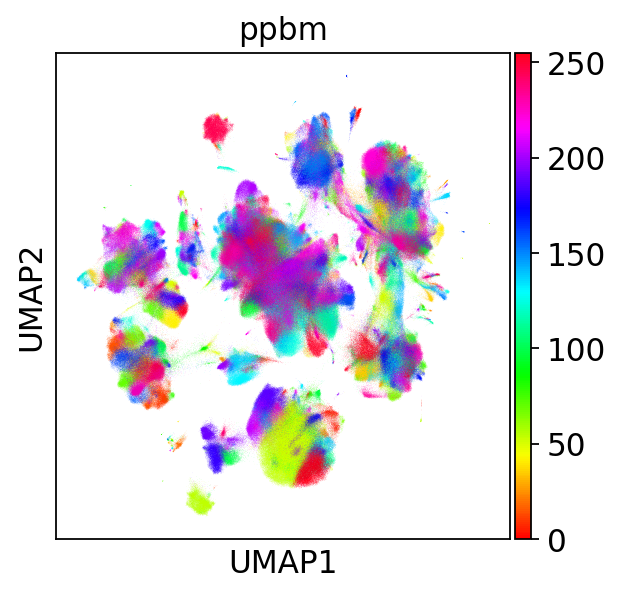
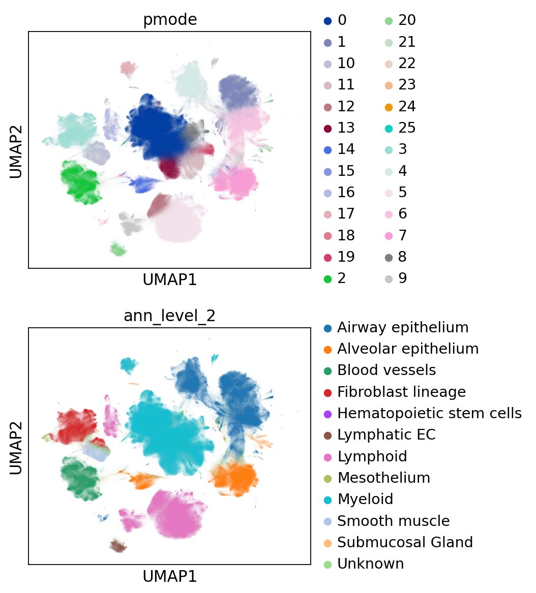
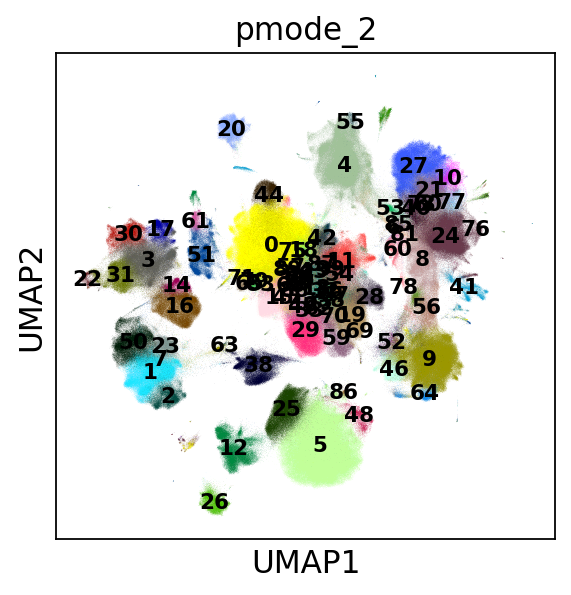
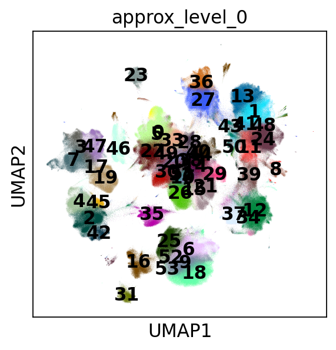

.. _large_samples:

==========================
Analysis of large datasets
==========================

It is stated in the `original paper <https://bmcbioinformatics.biomedcentral.com/articles/10.1186/s12859-021-04489-7>`__ (and also raised by users) that ``schist`` may be slow, especially for large datasets. While the underlying library is computationally efficient, the MCMC problem may be difficult to minimize and scales with the square of the number of the edges. In lay terms, this means that the number of cells and the number of neighbors used to build the kNN graph will, in turn, influence the speed of the procedure. Moreover, it is difficult to predict the actual execution time due to the specific nature of the data. In other words, there are datasets in which the algorithms converges pretty fast because the community structure is "easy to find".

While we are working on an appropriate solution, which may require complete rewriting of the library, there is one workaround that works in most cases, although the solution is not optimal. The solution goes through the analysis of multiple subsamples of the data. Since the MCMC does not scale linearly with the data size, the time required to analyze subsample is possibly smaller than the time required to analyze the full data. Of course, there's a huge drawback, that is the final solution won't ever have the same resolution and will find larger communities.

The following tutorial goes through the analysis of the HCA Lung datasets, downloaded from the cellxgene data portal, which includes more than 2 millions cells.

.. code:: python

    import scanpy as sc
    import schist as scs
    import graph_tool.all as gt
    import sklearn.neighbors as skn
    import sklearn.metrics as skmt
    import numpy as np
    import matplotlib as mpl
    import matplotlib.pyplot as plt
    from matplotlib.pyplot import *
    from pynndescent import NNDescent
    import anndata as ad
    import scipy.sparse as ssp
    import pandas as pd
    from tqdm import tqdm
    %matplotlib inline
    sc.set_figure_params()
    rcParams['axes.grid'] = False

The dataset is rather huge (20 Gb), we will perform operations without loading it into memory. Whenever we will need to modify its attributes, we will create a lightweight copy, including only the relevant information. 

.. code:: python

    adata = sc.read("local.h5ad", backed='r')
    print(adata.shape)

.. parsed-literal::

    (2282447, 56295)

Before going with subsampling, we show the results of a
``planted_model`` calculated on this dataset using a single iteration, in place of the 100 typically performed with ``schist``. It took approximately 13 hours to converge, which is long but possibly tractable, if you consider we are dealing with 2M cells

.. code:: python

    import pickle
    full_ppbm_state = pickle.load(open("HCA_full_ppbm.pickle", "rb"))
    print(full_ppbm_state)

.. parsed-literal::

    <PPBlockState object with 256 blocks, for graph <GraphView object, undirected, with 2282447 vertices and 51427121 edges, at 0x7ff2a0657d30>

Unfortunately, the model contains more than 100 blocks (256), so it
cannot be visualized properly using ``scanpy`` plotting facilities. Hence, we convert the groups into a continuous numbering.

.. code:: python

    _adata = ad.AnnData(ssp.csr_matrix(adata.shape))
    _adata.obs_values = adata.obs_names
    _adata.obs = adata.obs#.copy()
    _adata.obsm['X_umap'] = adata.obsm['X_umap']
    _cats = pd.Categorical(values=np.array(full_ppbm_state.get_blocks().a))
    _cats = np.array(_cats.codes)
    _adata.obs['ppbm'] = _cats
    sc.pl.umap(_adata, color='ppbm', cmap='hsv')

Subsampling a single cell dataset is a matter of active research. Some
have proposed geometric sketching as a valid strategy (as detailed
`here <https://www.sciencedirect.com/science/article/pii/S2405471219301528>`__).
We also have tried it but  noticed a tendency in oversampling rare
populations and undersampling common populations. While this is good in
the sense it may allow proper analysis of rare populations in large
datasets, it won’t conserve the block matrix. For this reason, we will
use random subsampling. 
Since it is matter of active research, expect this to change sometime in the future.

Anyhow, we start sampling 2000 cells 10 times

.. code:: python

    n_iter = 10
    N = 2000
    ski = np.zeros((n_iter, N))
    X = np.arange(adata.shape[0], dtype=np.int32)
    
    for x in range(n_iter):
        np.random.shuffle(X)
        ski[x] = X[:N]
        
    ski = ski.astype(int)

For every iteration, we create an empty dataset, only retaining the
original embedding. This is done for convenience, as we want to access
the kNN graph from an ``adata`` object. Once the model has been fit on
the subsampled data, we try to project it on the original data. It would
have been nice to use ``schist`` label transfer functions, but those are
not yet scalable to the size of this dataset, we will go with a
nearest neighbor approach. Since we are dealing with more than 2M cells,
we will use ``pynndescent`` library which is pretty efficient. 
To be honest, we haven’t found a way to use ``NNDescent`` to classify objects,
so we will use a majority vote on its predictions. 

.. code:: python

    n_neighbors=10
    use_rep='X_scanvi_emb'
    n_obs = N
    n_var = adata.shape[1]
    sketch_data = ad.AnnData(ssp.csr_matrix((n_obs, n_var)))
    query = adata.obsm[use_rep]
    labels = np.zeros((adata.shape[0], n_iter)).astype(int)
    for x in tqdm(range(n_iter)):    
        sketch_data.obsm[use_rep] = adata[ski[x]].obsm[use_rep].copy()
        sc.pp.neighbors(sketch_data, n_neighbors=n_neighbors, use_rep=use_rep)
        scs.inference.planted_model(sketch_data, dispatch_backend='loky')
        index = NNDescent(sketch_data.obsm['X_scanvi_emb'], n_neighbors=n_neighbors, metric='cosine', )
        C = np.array(sketch_data.obs['ppbm'].values).astype(int)
        pred = np.unique(C[index.query(query, k=5)[0]], axis=1)[:, 0]
        labels[:, x] = pred

.. parsed-literal::

    100%|██████████| 10/10 [07:44<00:00, 46.48s/it]

It takes less than a minute for each loop, which means we may analyze more than 10 iterations in reasonable times. 
The array ``label`` contains the predicted labels for 10 iterations, we
need the original graph to build the consensus partition. We can extract the graph from the full dataset, and instead of using the functions provided by ``scanpy`` or ``schist`` we build it directly in less time.

.. code:: python

    %%time
    g = gt.Graph(np.transpose(ssp.triu(adata.obsp['connectivities']).nonzero()), directed=False)

.. parsed-literal::

    CPU times: user 10.9 s, sys: 1.46 s, total: 12.3 s
    Wall time: 12.3 s

While each iteration above takes typically less than a minute to run,
and could be in principle parallelized, the following step will be the
most time consuming. Creating an instance of ``PartitionModeState`` is, once more, dependent on the data size and does not scale linearly with the number of solutions we want to include. In particular, while it takes slightly more than 1 minute when 10 iterations have been performed, it takes approximately 50 minutes for 100 iterations. 

.. code:: python

    %%time
    pmode = gt.PartitionModeState(labels.T, 
                                 converge=True)
    bs = pmode.get_max(g)

.. parsed-literal::

    CPU times: user 1min 5s, sys: 659 ms, total: 1min 5s
    Wall time: 1min 5s

An alternative route would be to invert the kNN prediction and the modal state analysis, so that the latter is performed on smaller data (subsamples).
Finally we can assign the paritions to the original data and plot. 

.. code:: python

    _adata.obs['pmode'] = pd.Categorical(values=np.array(bs.get_array()).astype('U'))
    sc.pl.umap(_adata, color=['pmode', 'ann_level_2'], ncols=1, )

The partitions seem to grasp some clustering closely related to the original level 2 annotation.

.. code:: python

    print(skmt.adjusted_rand_score(_adata.obs['pmode'], _adata.obs['ann_level_2']))

.. parsed-literal::

    0.5849991769939206

The resolution of the model depends on the subsampling ratio. We may expect higher resolution if we let larger samples, we here try with 10 times more cells (20,000).

.. code:: python

    n_iter = 10
    N = 20000
    ski = np.zeros((n_iter, N))
    X = np.arange(adata.shape[0], dtype=np.int32)
    for x in range(n_iter):
        np.random.shuffle(X)
        ski[x] = X[:N]   
    ski = ski.astype(int)
    
    n_obs = N
    sketch_data = ad.AnnData(ssp.csr_matrix((n_obs, n_var)))
    labels = np.zeros((adata.shape[0], n_iter)).astype(int)
    for x in tqdm(range(n_iter)):    
        sketch_data.obsm[use_rep] = adata[ski[x]].obsm[use_rep].copy()
        sc.pp.neighbors(sketch_data, n_neighbors=n_neighbors, use_rep=use_rep)
        scs.inference.planted_model(sketch_data, dispatch_backend='loky')
        index = NNDescent(sketch_data.obsm['X_scanvi_emb'], n_neighbors=n_neighbors, metric='cosine', )
        C = np.array(sketch_data.obs['ppbm'].values).astype(int)
        pred = np.unique(C[index.query(query, k=5)[0]], axis=1)[:, 0]
        labels[:, x] = pred
    
    pmode = gt.PartitionModeState(labels.T, 
                                 converge=True)
    bs = pmode.get_max(g)
    _adata.obs['pmode_2'] = pd.Categorical(values=np.array(bs.get_array()).astype('U'))
    sc.pl.umap(_adata,color='pmode_2', legend_loc='on data', legend_fontsize='x-small')

.. parsed-literal::

    100%|██████████| 10/10 [1:53:35<00:00, 681.52s/it]

As expected, the time required for each loop increases. Ideally one should find a good balance between the subsampling, the number of iterations and the overall time.
Comparing the partitions of the two strategies with the original extracted from the whole dataset, we notice that completeness increases in the second experiment, while homogeneity remains unchanged. This is in line with the expected behaviour as we obtain finer descriptions.

.. code:: python

    print(skmt.homogeneity_completeness_v_measure(_adata.obs['pmode'], _adata.obs['ppbm']))
    print(skmt.homogeneity_completeness_v_measure(_adata.obs['pmode_2'], _adata.obs['ppbm']))

.. parsed-literal::

    (0.7745131100402205, 0.376391515019105, 0.5065930860694394)
    (0.7550760248414273, 0.509460816790688, 0.6084150903160365)

The ``planted_model`` is an effective approach and returns assortative communities, in the analysis of kNN graphs derived from single cell data it is reasonable to expect those communities to reflect the population structure in terms of cell types. Nevertheless, we may be interested in the ``nested_model``, as well. The code is similar, except for the fact every iteration returns a matrix of groupings at different levels that we need to collect. It’s sufficient to transfer level 0 to the original dataset, the remaining levels will be mapped using a dictionary. In this experiment, we will use 100 iterations.
Note that here, as above, we need to convert the labels to something that ``np.unique()`` can handle (we use ``int``, but ``str`` would have worked). Maybe we should enforce
``dtypes`` in the inference functions…

.. code:: python

    n_iter = 100
    N = 2000
    ski = np.zeros((n_iter, N))
    X = np.arange(adata.shape[0], dtype=np.int32)
    
    for x in range(n_iter):
        np.random.shuffle(X)
        ski[x] = X[:N]
        
    ski = ski.astype(int)
    
    sketch_collect = []
    n_obs=N
    n_neighbors=10
    use_rep='X_scanvi_emb'
    sketch_data = ad.AnnData(ssp.csr_matrix((n_obs, n_var)))
    labels = []
    for x in tqdm(range(n_iter)):
        sketch_data.obsm[use_rep] = adata[ski[x]].obsm[use_rep].copy()
        sc.pp.neighbors(sketch_data, n_neighbors=n_neighbors, use_rep=use_rep)
        scs.inference.nested_model(sketch_data, dispatch_backend='loky')
        index = NNDescent(sketch_data.obsm['X_scanvi_emb'], n_neighbors=n_neighbors, metric='cosine', )
        C = np.array(sketch_data.obs['nsbm_level_0'].values).astype(int)
        pred0 = np.unique(C[index.query(query, k=5)[0]], axis=1)[:, 0]
    
        n_blocks = len(sketch_data.uns['schist']['nsbm']['blocks'])
        _label = np.zeros((adata.shape[0], n_blocks)).astype(int)
        _label[:, 0] = pred0.astype(int)
        for y in range(1, n_blocks):
            dd = dict(sketch_data.obs[[f'nsbm_level_0', f'nsbm_level_{y}']].drop_duplicates().astype(int).values)
            _label[:, y] = [int(dd[v]) for v in pred0]
    
        labels.append(_label)

.. parsed-literal::

    100%|██████████| 100/100 [2:02:58<00:00, 73.78s/it] 

We notice that the ``nested_model`` on 2000 cells takes more time to
compute than the ``planted_model`` (one full loop takes ~73 vs
~42). To proceed, we don’t need to create a new graph, instead we need
a different model for the consesus partition. First we need to create
the necessary block states. Again, to save time one could swap the ``NNDescent`` projection with the definition of the mode partition.

.. code:: python

    %%time
    states = []
    for x in range(n_iter):
        states.append(gt.NestedBlockState(g, 
                        bs=labels[x].T, 
                       deg_corr=True))

.. parsed-literal::

    CPU times: user 18min 7s, sys: 14.6 s, total: 18min 21s
    Wall time: 15min 47s

As expected, the following step takes quite large time, in this case because we are working with 100 iterations

.. code:: python

    %%time
    pmode_nested = gt.PartitionModeState([x.get_bs() for x in states], converge=True, nested=True)
    bs = pmode_nested.get_max_nested()

.. parsed-literal::

    CPU times: user 1h 58min 57s, sys: 6.51 s, total: 1h 59min 4s
    Wall time: 1h 59min 3s

.. code:: python

    #these lines are only needed to prune redundant top hierarchies having only one group
    bs = [x for x in bs if len(np.unique(x)) > 1]
    bs.append(np.array([0], dtype=np.int32)) #in case of type changes, check this

Lastly get the final block state and add all the annotations to the
“empty” data

.. code:: python

    state = gt.NestedBlockState(g, bs=bs,
                                deg_corr=True)
    _adata.obs['approx_level_0'] = bs[0].astype(str)
    for x in range(1, len(state.levels)):
        _adata.obs[f'approx_level_{x}'] = np.array(state.project_partition(x, 0).a).astype(str)
    sc.pl.umap(_adata, color=['approx_level_0'], legend_loc='on data')

