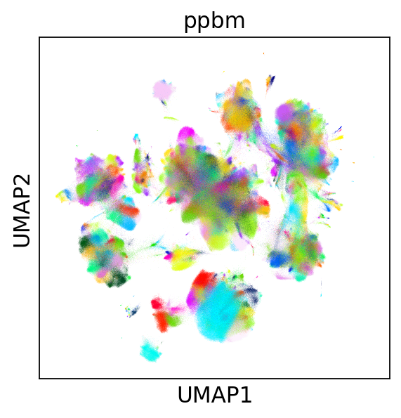
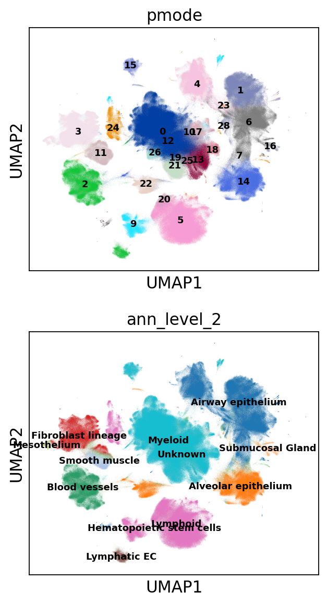
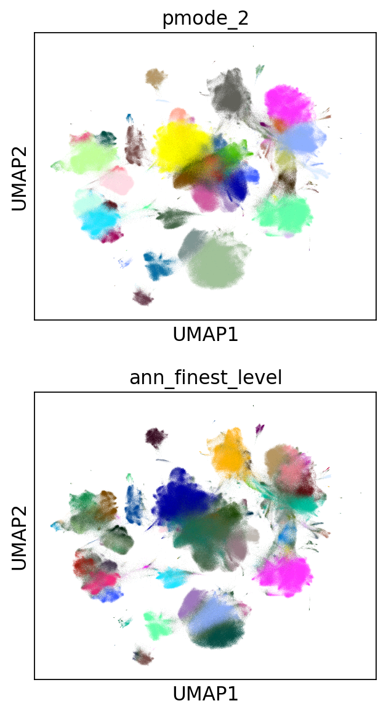
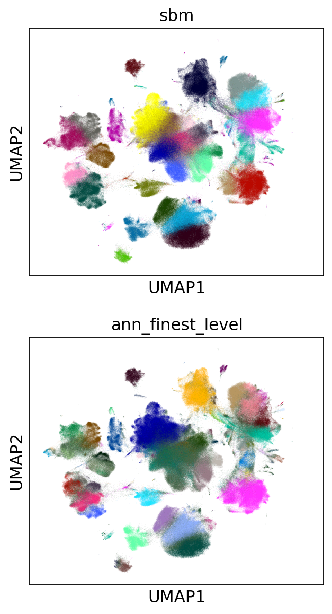
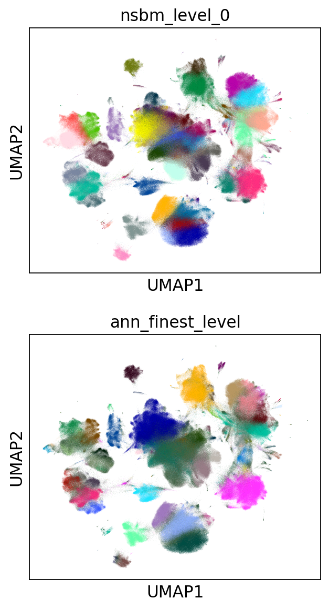

.. _large_samples:

==========================
Analysis of large datasets
==========================

It is stated in the (original
paper)[https://bmcbioinformatics.biomedcentral.com/articles/10.1186/s12859-021-04489-7]
(and also raised by users) that ``schist`` may be slow, especially for
large datasets. While the underlying library is computationally
efficient, the MCMC problem may be difficult to minimize and scales with
the square of the number of the edges. In lay terms, this means that the
number of cells and the number of neighbors used to build the kNN graph
will, in turn, influence the speed of the procedure. Moreover, it is
difficult to predict the actual execution time due to the specific
nature of the data. In other words, there are datasets in which the
algorithms converges pretty fast because the community structure is
“easy to find”.

While we are working on an appropriate solution, which may require
complete rewriting of the library, there is one workaround that works in
most cases, although the solution is not optimal. The solution goes
through the analysis of multiple subsamples of the data. Since the MCMC
does not scale linearly with the data size, the time required to analyze
subsample is possibly smaller than the time required to analyze the full
data. Of course, there’s a huge drawback, that is the final solution
won’t ever have the same resolution and will find larger communities.

The following tutorial goes through the analysis of the HCA Lung
datasets, downloaded from the cellxgene data portal, which includes more
than 2 millions cells.

.. code:: python

    import scanpy as sc
    import schist as scs
    import graph_tool.all as gt
    import sklearn.neighbors as skn
    import sklearn.metrics as skmt
    import numpy as np
    import matplotlib as mpl
    import matplotlib.pyplot as plt
    from matplotlib.pyplot import *
    from pynndescent import NNDescent
    import anndata as ad
    import scipy.sparse as ssp
    import pandas as pd
    from tqdm import tqdm
    
    %matplotlib inline
    sc.set_figure_params()
    rcParams['axes.grid'] = False

The dataset is rather huge (20 Gb), we will perform operations without
loading it into memory. Whenever we will need to modify its attributes,
we will create a lightweight copy, including only the relevant
information.

.. code:: python

    adata = sc.read("local.h5ad", backed='r')
    print(adata.shape)

.. parsed-literal::

    (2282447, 56295)

The Planted Partition Model
---------------------------

Before going with subsampling, we show the results of a
``planted_model`` calculated on this dataset using a single iteration,
in place of the 100 typically performed with ``schist``. It took
approximately 13 hours to converge, which is long but possibly
tractable, if you consider we are dealing with 2M cells

.. code:: python

    import pickle
    full_ppbm_state = pickle.load(open("HCA_full_ppbm.pickle", "rb"))
    print(full_ppbm_state)

.. parsed-literal::

    <PPBlockState object with 256 blocks, for graph <GraphView object, undirected, with 2282447 vertices and 51427121 edges, at 0x7f6f027728f0>

Unfortunately, the model contains more than 100 blocks (256), so it
cannot be visualized properly using ``scanpy`` plotting facilities.
Hence, we create the appropriate number of colors choosing from a
continuous colormap.

.. code:: python

    _adata = ad.AnnData(ssp.csr_matrix(adata.shape))
    _adata.obs_values = adata.obs_names
    _adata.obs = adata.obs#.copy()
    _adata.obsm['X_umap'] = adata.obsm['X_umap']
    scs._utils.plug_state(_adata, full_ppbm_state, key_added='ppbm')
    _adata.uns['ppbm_colors'] = [mpl.colors.rgb2hex(x) for x in cm.gist_ncar(np.linspace(0, 1, full_ppbm_state.get_nonempty_B()))]
    sc.pl.umap(_adata, color='ppbm', legend_loc=None)

Subsampling a single cell dataset is a matter of active research. Some
have proposed geometric sketching as a valid strategy (as detailed
`here <https://www.sciencedirect.com/science/article/pii/S2405471219301528>`__).
I have tried it but I’ve noticed a tendency in oversampling rare
populations and undersampling common populations. While this is good in
the sense it may allow proper analysis of rare populations in large
datasets, it won’t conserve the block matrix. For this reason, we will
use random subsampling. Since it is matter of active research, expect
this to change sometime in the future.

Anyhow, we will sample 2000 cells 20 times

.. code:: python

    n_iter = 20
    N = 2000
    ski = np.zeros((n_iter, N))
    X = np.arange(adata.shape[0], dtype=np.int32)
    
    for x in range(n_iter):
        np.random.shuffle(X)
        ski[x] = X[:N]
        
    ski = ski.astype(int)

For every iteration, we create an empty dataset, only retaining the
original embedding. This is done for convenience, as we want to access
the kNN graph from an ``adata`` object. Once the model has been fit on
the subsampled data, we try to project it on the original data. It would
have been nice to use ``schist`` label transfer functions, but those are
not really scalable to the size of this dataset, we will go with a
nearest neighbor approach. Since we are dealing with more than 2M cells,
we will use ``pynndescent`` library that is pretty efficient. To be
honest, I haven’t found a way to use ``NNDescent`` to classify objects,
so we will use a majority vote on its predictions. To start, we analyze
data using the ``planted_model``, which is a simple and faster way to
get cell populations.

.. code:: python

    import warnings
    warnings.filterwarnings('ignore')
    n_neighbors=10
    use_rep='X_scanvi_emb'
    n_obs = N
    n_var = adata.shape[1]
    sketch_data = ad.AnnData(ssp.csr_matrix((n_obs, n_var)))
    query = adata.obsm[use_rep]
    pred_labels = np.zeros((adata.shape[0], n_iter)).astype(int)
    for x in tqdm(range(n_iter)):    
        sketch_data.obsm[use_rep] = adata[ski[x]].obsm[use_rep].copy()
        sc.pp.neighbors(sketch_data, n_neighbors=n_neighbors, use_rep=use_rep)
        scs.inference.planted_model(sketch_data, dispatch_backend='loky')
        index = NNDescent(sketch_data.obsm['X_scanvi_emb'], n_neighbors=n_neighbors, metric='cosine', )
        C = np.array(sketch_data.obs['ppbm'].values).astype(int)
        pred = np.unique(C[index.query(query, k=5)[0]], axis=1)[:, 0]
        pred_labels[:, x] = pred

.. parsed-literal::

    100%|██████████| 20/20 [14:43<00:00, 44.18s/it]

It takes less than a minute for each loop, which means we may analyze
more than 20 iterations in reasonable times. The array ``label``
contains the predicted labels for all iterations, we need the original
graph to build the consensus partition. We can extract the graph from
the full dataset, and instead of using the functions provided by
``scanpy`` or ``schist`` we build it directly in less time.

.. code:: python

    %%time
    g = gt.Graph(np.transpose(ssp.triu(adata.obsp['connectivities']).nonzero()), directed=False)

.. parsed-literal::

    CPU times: user 10.6 s, sys: 1.53 s, total: 12.1 s
    Wall time: 12.1 s

While each iteration above takes typically less than a minute to run,
and could be in principle parallelized, the following step will be the
most time consuming. Creating an instance of ``PartitionModeState`` is,
once more, dependent on the data size and does not scale linearly with
the number of solutions we want to include. In particular, while it
takes slightly more than 3 minutes when 20 iterations have been
performed, it takes approximately 50 minutes for 100 iterations.

.. code:: python

    %%time
    pmode = gt.PartitionModeState(pred_labels.T, 
                                 converge=True)
    bs = pmode.get_max(g)

.. parsed-literal::

    CPU times: user 2min 17s, sys: 630 ms, total: 2min 18s
    Wall time: 2min 18s

Finally we can assign the paritions to the original data and plot.

.. code:: python

    _adata.obs['pmode'] = pd.Categorical(values=np.array(bs.get_array()).astype('U'))
    sc.pl.umap(_adata, color=['pmode', 'ann_level_2'], ncols=1, legend_loc='on data', legend_fontsize='xx-small')

The partitions seem to grasp some clustering closely related to the
original level 2 annotation.

.. code:: python

    print(skmt.adjusted_rand_score(_adata.obs['pmode'], _adata.obs['ann_level_2']))

.. parsed-literal::

    0.5801220132920343

The resolution of the model depends on the subsampling ratio. We try the
same procedure taking 5 times more cells

.. code:: python

    n_iter = 20
    N = 10000
    ski = np.zeros((n_iter, N))
    X = np.arange(adata.shape[0], dtype=np.int32)
    for x in range(n_iter):
        np.random.shuffle(X)
        ski[x] = X[:N]   
    ski = ski.astype(int)
    
    n_obs = N
    sketch_data = ad.AnnData(ssp.csr_matrix((n_obs, n_var)))
    pred_labels = np.zeros((adata.shape[0], n_iter)).astype(int)
    for x in tqdm(range(n_iter)):    
        sketch_data.obsm[use_rep] = adata[ski[x]].obsm[use_rep].copy()
        sc.pp.neighbors(sketch_data, n_neighbors=n_neighbors, use_rep=use_rep)
        scs.inference.planted_model(sketch_data, dispatch_backend='loky')
        index = NNDescent(sketch_data.obsm['X_scanvi_emb'], n_neighbors=n_neighbors, metric='cosine', )
        C = np.array(sketch_data.obs['ppbm'].values).astype(int)
        pred = np.unique(C[index.query(query, k=5)[0]], axis=1)[:, 0]
        pred_labels[:, x] = pred
    
    pmode = gt.PartitionModeState(pred_labels.T, 
                                 converge=True)
    bs = pmode.get_max(g)
    _adata.obs['pmode_2'] = pd.Categorical(values=np.array(bs.get_array()).astype('U'))

.. parsed-literal::

    100%|██████████| 20/20 [1:27:19<00:00, 261.95s/it]

As expected, the time required for each loop increases. Ideally one
should find a good balance between the subsampling, the number of
iterations and the overall time. Comparing the partitions of the two
strategies with the original extracted from the whole dataset, we notice
that completeness increases in the second experiment, while homogeneity
remains unchanged. This is in line with the expected behaviour as we
obtain finer descriptions.

.. code:: python

    print(skmt.homogeneity_completeness_v_measure(_adata.obs['pmode'], _adata.obs['ppbm']))
    print(skmt.homogeneity_completeness_v_measure(_adata.obs['pmode_2'], _adata.obs['ppbm']))

.. parsed-literal::

    (0.7796964452269838, 0.37712915167813155, 0.5083674838135956)
    (0.7664660005824697, 0.47533707936760183, 0.5867753366597966)

The effect of finer clustering can be appreciated comparing to the
highest detail available for this dataset

.. code:: python

    sc.pl.umap(_adata,color=['pmode_2', 'ann_finest_level'],
               ncols=1, legend_loc=None)

The default models
------------------

The ``planted_model`` is an effective approach and returns assortative
communities, in the analysis of kNN graphs derived from single cell data
it is reasonable to expect those communities to reflect the population
structure in terms of cell types. Nevertheless, we may be interested in
the Stochastic Block Model or its Nested formulation as well. Those
approach incorporate other priors in the model, possibly identifying
other properties of the dataset. While the code for the ``flat_model``
is substantially the same, for the ``nested_model`` we need to collect
the matrix of groupings at different levels. It’s sufficient to transfer
level 0 to the original dataset, the remaining levels will be mapped
using a dictionary.

.. code:: python

    n_iter = 20
    N = 2000
    ski = np.zeros((n_iter, N))
    X = np.arange(adata.shape[0], dtype=np.int32)
    for x in range(n_iter):
        np.random.shuffle(X)
        ski[x] = X[:N]   
    ski = ski.astype(int)
    
    n_obs = N
    sketch_data = ad.AnnData(ssp.csr_matrix((n_obs, n_var)))
    pred_labels = np.zeros((adata.shape[0], n_iter)).astype(int)
    for x in tqdm(range(n_iter)):    
        sketch_data.obsm[use_rep] = adata[ski[x]].obsm[use_rep].copy()
        sc.pp.neighbors(sketch_data, n_neighbors=n_neighbors, use_rep=use_rep)
        scs.inference.flat_model(sketch_data, dispatch_backend='loky', deg_corr=True)
        index = NNDescent(sketch_data.obsm['X_scanvi_emb'], n_neighbors=n_neighbors, metric='cosine', )
        C = np.array(sketch_data.obs['sbm'].values).astype(int)
        pred = np.unique(C[index.query(query, k=5)[0]], axis=1)[:, 0]
        pred_labels[:, x] = pred
    
    pmode = gt.PartitionModeState(pred_labels.T, 
                                 converge=True)
    bs = pmode.get_max(g)
    _adata.obs['sbm'] = pd.Categorical(values=np.array(bs.get_array()).astype('U'))

.. parsed-literal::

    100%|██████████| 20/20 [16:50<00:00, 50.51s/it]

The resolution for the ``flat_model`` using a small subsample is similar
to the one obtained with the ``planted_model`` on larger sampling.

.. code:: python

    sc.pl.umap(_adata,color=['sbm', 'ann_finest_level'],
               ncols=1,
               legend_loc=None)

.. code:: python

    skmt.adjusted_mutual_info_score(_adata.obs['ann_finest_level'], _adata.obs['sbm'])

.. parsed-literal::

    0.6371068117249558

Lastly we can try the ``nested_model``

.. code:: python

    n_iter = 20
    N = 2000
    ski = np.zeros((n_iter, N))
    X = np.arange(adata.shape[0], dtype=np.int32)
    
    for x in range(n_iter):
        np.random.shuffle(X)
        ski[x] = X[:N]
        
    ski = ski.astype(int)
    
    sketch_collect = []
    n_obs=N
    n_neighbors=10
    use_rep='X_scanvi_emb'
    sketch_data = ad.AnnData(ssp.csr_matrix((n_obs, n_var)))
    labels = []
    for x in tqdm(range(n_iter)):
        sketch_data.obsm[use_rep] = adata[ski[x]].obsm[use_rep].copy()
        sc.pp.neighbors(sketch_data, n_neighbors=n_neighbors, use_rep=use_rep)
        scs.inference.nested_model(sketch_data, dispatch_backend='loky')
        index = NNDescent(sketch_data.obsm['X_scanvi_emb'], n_neighbors=n_neighbors, metric='cosine', )
        C = np.array(sketch_data.obs['nsbm_level_0'].values).astype(int)
        pred0 = np.unique(C[index.query(query, k=5)[0]], axis=1)[:, 0]
    
        n_blocks = len(sketch_data.uns['schist']['nsbm']['blocks'])
        _label = np.zeros((adata.shape[0], n_blocks)).astype(int)
        _label[:, 0] = pred0.astype(int)
        for y in range(1, n_blocks):
            dd = dict(sketch_data.obs[[f'nsbm_level_0', f'nsbm_level_{y}']].drop_duplicates().astype(int).values)
            _label[:, y] = [int(dd[v]) for v in pred0]
    
        labels.append(_label)

.. parsed-literal::

    100%|██████████| 20/20 [24:47<00:00, 74.38s/it]

In terms of computation time, we notice that ``nested_model`` >
``flat_model`` > ``planted_model``. To proceed, we need a different way
to treat the consesus partition. First we need to create the necessary
block states.

.. code:: python

    %%time
    states = []
    for x in range(n_iter):
        states.append(gt.NestedBlockState(g, 
                        bs=labels[x].T, 
                       deg_corr=True))

.. parsed-literal::

    CPU times: user 3min 45s, sys: 3.14 s, total: 3min 48s
    Wall time: 3min 17s

.. code:: python

    %%time
    pmode_nested = gt.PartitionModeState([x.get_bs() for x in states], converge=True, nested=True)
    bs = pmode_nested.get_max_nested()

.. parsed-literal::

    CPU times: user 11min 35s, sys: 616 ms, total: 11min 35s
    Wall time: 11min 35s

.. code:: python

    #these lines are only needed to prune redundant top hierarchies having only one group
    bs = [x for x in bs if len(np.unique(x)) > 1]
    bs.append(np.array([0], dtype=np.int32)) #in case of type changes, check this

Lastly get the final block state and add all the annotations to the
“empty” data

.. code:: python

    state = gt.NestedBlockState(g, bs=bs,
                                deg_corr=True)
    _adata.obs['nsbm_level_0'] = bs[0].astype(str)
    for x in range(1, len(state.levels)):
        _adata.obs[f'nsbm_level_{x}'] = np.array(state.project_partition(x, 0).a).astype(str)

It is worth noting that the lowest level of the hierarchy reflects the
groups in a subsampled datasets, hence it won’t ever be a faithful
representation of what’s in the whole dataset. It is also true that
lowest levels are rarely used in the analysis, as most of the
interesting cell groups appear at higher levels. Also, if this dataset
contained a very rare cell population (say, less than 100 cells) it is
very unlikely that it will pop out using this approach

.. code:: python

    sc.pl.umap(_adata,color=['nsbm_level_0', 'ann_finest_level'],
               ncols=1,
               legend_loc=None)

.. code:: python

    skmt.adjusted_mutual_info_score(_adata.obs['ann_finest_level'], _adata.obs['nsbm_level_0'])

.. parsed-literal::

    0.6123523204785928

Model Refinement
----------------

Since these solutions are all approximations, it may be worth to refine
them, forcing a fixed number of MCMC iterations and assuming the current
approximated solution would be the start of a better chain. We will run
a very small number of iterations (10), in reality it may be better to
increase it, depending on the available time.

.. code:: python

    ppbm_state = gt.PPBlockState(g, b=np.array(_adata.obs['pmode_2'].cat.codes))
    E1 = ppbm_state.entropy()
    nb1 = ppbm_state.get_nonempty_B()
    for n in tqdm(range(10)):
        ppbm_state.multiflip_mcmc_sweep(beta=np.inf, niter=10, c=0.5)
    E2 = ppbm_state.entropy()    
    nb2 = ppbm_state.get_nonempty_B()

.. parsed-literal::

     10%|█         | 1/10 [01:35<14:17, 95.24s/it]

.. code:: python

    print(f"Entropy before refinement: {E1}")
    print(f"Entropy after refinement: {E2}")
    print(f"Number of blocks before refinement: {nb1}")
    print(f"Number of blocks after refinement: {nb2}")

.. code:: python

    scs._utils.plug_state(_adata, ppbm_state, key_added='refined_ppbm')
    if nb2 > 100:
        _adata.uns['refined_ppbm_colors'] = [mpl.colors.rgb2hex(x) for x in cm.gist_ncar(np.linspace(0, 1, nb2))]
    sc.pl.umap(_adata, color='refined_ppbm', legend_loc=None)

.. code:: python

    sbm_state = gt.BlockState(g, b=np.array(_adata.obs['sbm'].cat.codes))
    E1 = sbm_state.entropy()
    nb1 = sbm_state.get_nonempty_B()

.. code:: python

    E1, nb1

.. parsed-literal::

    (478289202.93164676, 38)

.. code:: python

    for n in tqdm(range(100)):
        sbm_state.multiflip_mcmc_sweep(beta=np.inf, niter=10, c=0.5)
    scs._utils.plug_state(_adata, sbm_state, key_added='refined_sbm')
    _adata.uns['refined_sbm_colors'] = [mpl.colors.rgb2hex(x) for x in cm.gist_ncar(np.linspace(0, 1, sbm_state.get_nonempty_B()))]
    sc.pl.umap(_adata, color='refined_sbm', legend_loc=None)

Conclusions
-----------

How do these solutions compare to a model that takes the whole dataset?
For the ``planted_model`` and the ``flat_model`` the subsampled
solutions can be considered coarser descriptions of the same model. In
the full model, the partition sizes are rather small compared to the
size of the dataset. The full ``flat_model``, in particular, will find
thousands of groups (given that $ B
:raw-latex:`\propto `:raw-latex:`\sqrt{N}`
:math:`, we may expect ~1.5e3 groups in this case), which may be unpractical to analyze. Since the model from subsampled data will raise many less groups, the subsampled solution may even be preferable. As for the `nested_model`, we will obtain a even coarser description; the nested model, in fact, is able to identify smaller groups (`
B :raw-latex:`\propto `N/:raw-latex:`\log`(N) $, ~1.35e3 in this case).
In addition, we should ensure that the hierarchy is somehow consistent,
otherwise we should drop (for now) the possibility to subsample data for
the ``nested_model``.

