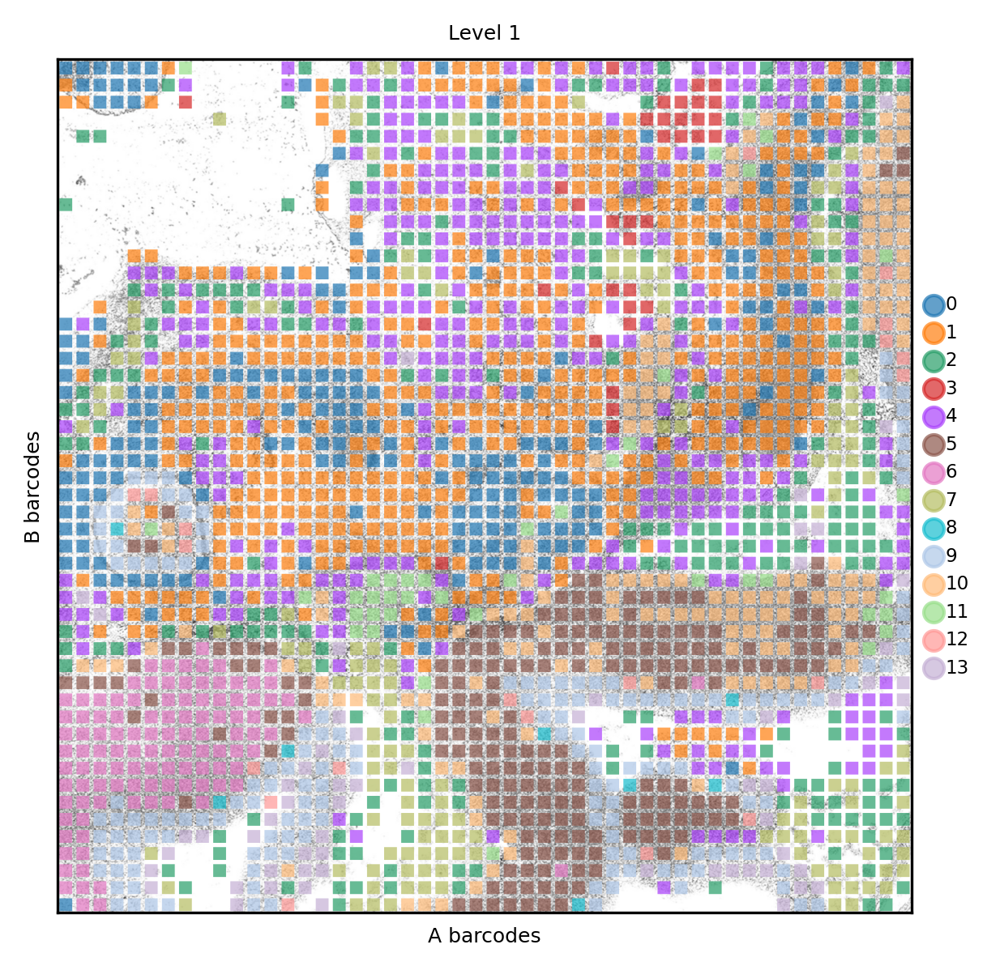
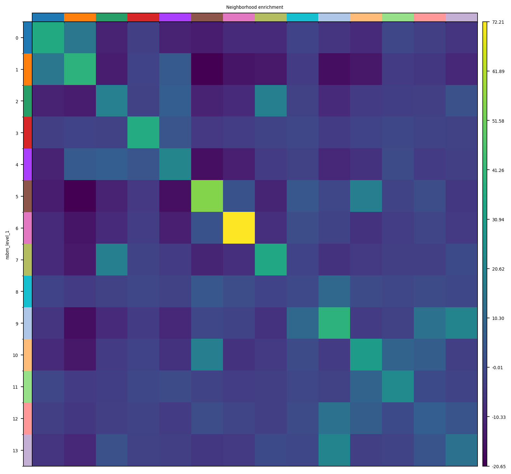

.. _spatial_atac:

============================================
Analysis of spatially resolved ATAC-seq data
============================================

Fastq from the paper "**Spatial epigenome–transcriptome co-profiling of mammalian tissues**" (Zhang et al, 2023, DOI:10.1038/s41586-023-05795-1) were downloaded (SRA run ID: SRR22565186) and processed using ``chromap``. The resulting fragment file is imported using ``snapatac2``. Here's just a plot showing the general performance of the spatial ATAC-seq data.
First of all, we import all required libraries.

.. code:: python

	import numpy as np
	import pandas as pd
	import matplotlib
	import matplotlib.pyplot as plt
	from matplotlib.pyplot import *
	
	import anndata as ad
	import scanpy as sc
	import snapatac2 as snap
	
	import scipy.sparse as ssp
	import scipy.stats as sst
	
	import spatialdata_io
	import spatialdata_plot
	import spatialdata as sd
	
	import squidpy as sq
	import schist as scs
	import warnings
	warnings.filterwarnings('ignore')
	#import magic
	from tqdm import tqdm
	
	def set_res(high=True):
		dpi=80
		if high:
			dpi=150
		sc.set_figure_params(dpi=dpi, fontsize=6)
		rcParams['axes.grid'] = False
	
	set_res(False)

Parsing of fragment is performed using standard parameters. THe whitelist here is the list of all 2500 barcodes allowed by the DBiT-seq circuit.

.. code:: python

	adata = snap.pp.import_data('SRR22565186.bed.gz', 
	                             sorted_by_barcode=False,
								 whitelist='whitelist.txt', backend=None,
								 chunk_size=20000,
								 min_num_fragments=0, 
								 chrom_sizes=snap.genome.mm10)
	snap.pl.frag_size_distr(adata, interactive=False)
	snap.metrics.frip(adata, {"peaks_frac": snap.datasets.cre_HEA()})
	snap.metrics.tsse(adata, snap.genome.mm10)
	snap.pl.tsse(adata, interactive=False, )

    

We bin genome at 1000 bp, apply some filters and apply ``snapatac``'s fast dimensionality reduction scheme after selecting variable features. We save the `.h5ad` file that is used to build a ``spatialdata`` object

.. code:: python
	
	snap.pp.add_tile_matrix(adata, counting_strategy='paired-insertion', bin_size=1000)
	adata.obs['log_fragment'] = np.log10(adata.obs['n_fragment'])
	cells = adata.obs.query('n_fragment >= 5000 and tsse >= 3 and n_fragment <=100000').index
	adata = adata[cells].copy()
	#select the top 50k regions
	snap.pp.select_features(adata, 
                            filter_upper_quantile=0.,
                            n_features=50000,
                            max_iter=1, blacklist='mm10-blacklist.v2.bed.gz')
	snap.tl.spectral(adata)
	adata.write("analysis/atac_raw.h5ad")

Here the ``anndata`` is imported using the DBiT-seq plugin for ``spatialdata``. Note that we had to rotate the original image from the paper 90 degrees CCW, as the current version of the plugin orders the barcodes differently from what is displayed in the original paper.

.. code:: python

	spdata = spatialdata_io.readers.dbit.dbit(path='analysis',
	                                        anndata_path='analysis/atac_raw.h5ad', 
	                                        barcode_position='barcodes.txt',
	                                        image_path='ME13_50um_spatial/tissue_hires_image.png',
	                                        dataset_id='ME13_50um_spatial'
                                     )

The TSS enrichment is visualized in its spatial context. The eye and the forebrain regions have the highest TSSE values.

.. code:: python
	set_res(True)
	spdata.pl.render_images().pl.render_shapes(color='tsse', fill_alpha=1).pl.show(title='TSSE')
	xticks([])
	yticks([])
	plt.xlabel('A barcodes')
	plt.ylabel('B barcodes')

    

    

The coverage is unevenly distributed. We here notice an issue common in DBiT-seq, that is some channels _stripe_ the tissue because of differences in the flows. 

.. code:: python
	spdata.pl.render_images().pl.render_shapes(color='log_fragment', fill_alpha=0.4, cmap='RdYlBu_r').pl.show('global', title='coverage', colorbar=True)
	xticks([])
	yticks([])
	plt.xlabel('A barcodes')
	plt.ylabel('B barcodes')

    

We here create the kNN graph, according to the spectral reduction performed above. A UMAP plot is also presented (not that we are going to use it, anyway).

.. code::python 

	n_neighbors = 15
	sc.pp.neighbors(spdata.table, use_rep='X_spectral', 
					metric='cosine',
					key_added='spectral_neighbors',
					n_neighbors=n_neighbors)#, n_pcs=10)
	set_res(False)
	sc.tl.umap(spdata.table, neighbors_key='spectral_neighbors')#, min_dist=0.1)
	sc.pl.umap(spdata.table, color=['log_fragment', 'tsse'])

Here a simple hierarchical model is performed using ``schist`` on the kNN graph above. The clusters at level 1 and 2 are shown in UMAP.

.. code:: python

	basis='spectral'
	sc.settings.verbosity=2
	scs.inference.nested_model(spdata.table, 
							   neighbors_key=f'{basis}_neighbors', 
							   dispatch_backend='loky')
	sc.settings.verbosity=0

.. code:: parsed-literal

    minimizing the nested Stochastic Block Model
            minimization step done (0:01:28)
            consensus step done (0:01:46)
        done (0:01:46)
        finished (0:01:46)

.. code:: python

	sc.pl.umap(spdata.table, color=['nsbm_level_1', 'nsbm_level_2'])

Finally we can check how clusters distribute in their spatial context. At level 1 we can distinguish certain clusters that belong to the neual tissues.

.. code:: python

	set_res(True)
	spdata.pl.render_images().pl.render_shapes(color='nsbm_level_1', fill_alpha=.7).pl.show(title='Level 1', colorbar=True)
	xticks([])
	yticks([])
	plt.xlabel('A barcodes')
	plt.ylabel('B barcodes')

The neural clusters are also the ones with highest self-enrichment in their neighborhood.

.. code:: python

	sq.gr.spatial_neighbors(spdata.table, n_neighs=8, coord_type='grid')
	sq.gr.nhood_enrichment(spdata.table, cluster_key="nsbm_level_1")
	set_res(False)
	sq.pl.nhood_enrichment(spdata.table, cluster_key="nsbm_level_1")

Can we perform better than this? One idea would be to integrate the spatial information into the model. Spatial data, especially for grid-like data as in DBiT-seq, do not have a community structure, yet they can be used to enforce local communities. ``schist`` does not yet support spatial graphs with a specific function, however we can create an object with a spatial graph (copying the original) and apply the multimodal nested solution, specifying the two graphs needed.

.. code:: python
	_tmp = spdata.table.copy()

	sc.settings.verbosity=2
	scs.inference.nested_model_multi([spdata.table, _tmp], 
									 key_added='spt', 
									 neighbors_key=['spectral_neighbors', 'spatial_neighbors'], 
									 dispatch_backend='loky')
	sc.settings.verbosity=0

.. code:: parsed-literal

    minimizing the nested Stochastic Block Model
    getting adjacency for data 0 (0:00:00)
    getting adjacency for data 1 (0:00:00)
            minimization step done (0:05:39)
            consensus step done (0:05:50)
        done (0:05:50)
        finished (0:05:50)

The process takes more time than above, but the results are clearly matching the anatomycal structures. We now see clusters 9 and 13 marking two structures that were not visibile in the original publication, if not with RNA-seq

.. code:: python
	
	set_res(True)
	spdata.pl.render_images().pl.render_shapes(color='spt_level_1', fill_alpha=.7).pl.show(title='SPT level 1', colorbar=True)
	xticks([])
	yticks([])
	plt.xlabel('A barcodes')
	plt.ylabel('B barcodes')

We save the results for later analysis

.. code:: python

	spdata.write('analysis/SRR22565186.zarr')
	