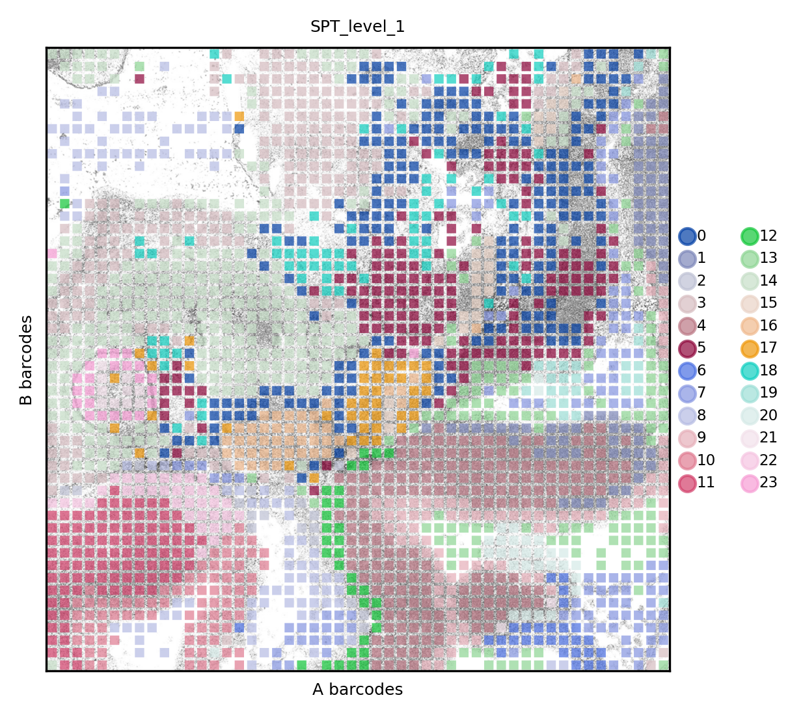
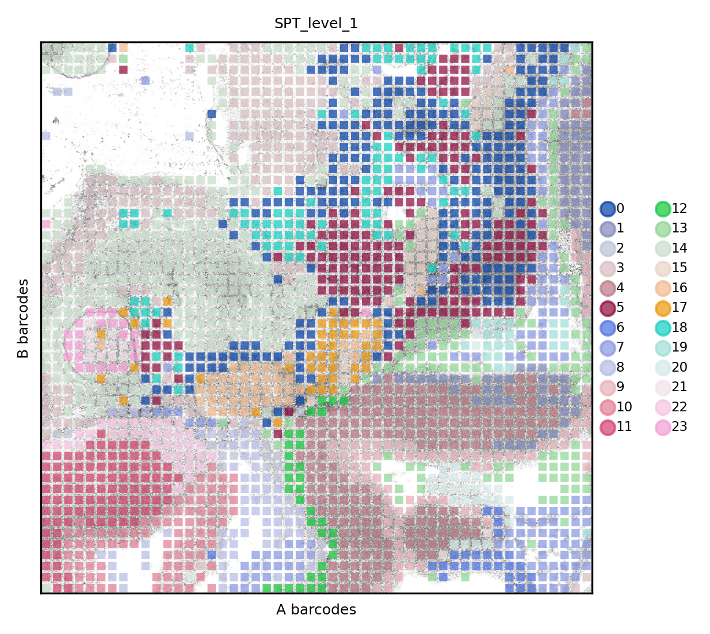
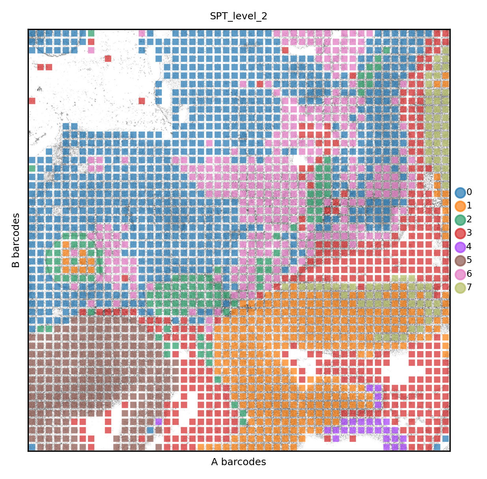
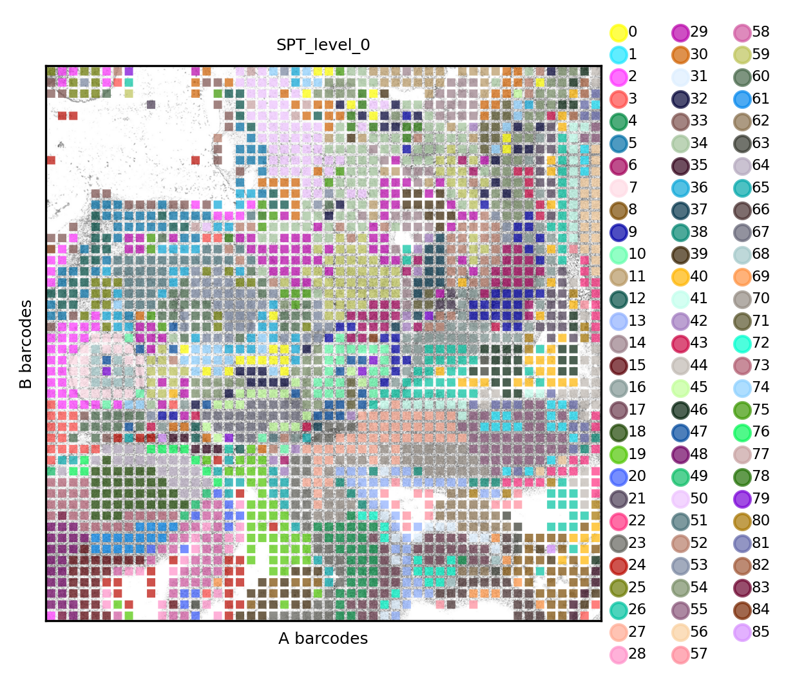

.. _spatial_multi:

=============================================
Combined analysis of multimodal DBiT-seq data
=============================================

In this page we show how to perform multimodal integration of spatially resolved data. We previously performed `ATAC <../Spatial_ATAC/spatial_atac.html>`_ and `RNA <../Spatial_RNA/spatial_rna.html>`_ analysis.
We start loading required libaries and load the previously saved data.

.. code:: python

	import numpy as np
	import pandas as pd
	import matplotlib
	import matplotlib.pyplot as plt
	from matplotlib.pyplot import *
	
	import anndata as ad
	import scanpy as sc
	import scipy.sparse as ssp
	
	import spatialdata_io
	import spatialdata_plot
	import spatialdata as sd
	
	import squidpy as sq
	import schist as scs
	import warnings
	warnings.filterwarnings('ignore')

	def set_res(high=True):
		dpi=80
		if high:
			dpi=150
		sc.set_figure_params(dpi=dpi, fontsize=6)
		rcParams['axes.grid'] = False
	
	set_res(False)

Here we actually load data

.. code:: python

	atac = sd.read_zarr('analysis/SRR22565186.zarr')
	rna = sd.read_zarr('analysis/SRR22561636.zarr')

We here perform the analysis without the need of having the same pixels in both datasets. That means we need a single spatial graph that is the union of RNA and ATAC, yet we have to keep it ordered, to recreate the proper spatial coordinates.

.. code:: python

	all_cells = atac.table.obs_names.union(rna.table.obs_names)
	emx = ssp.csr_matrix((len(all_cells), 1), dtype=np.int32)
	
	_tmp =ad.AnnData(emx)
	_tmp.obs_names = all_cells
	_tmp.obs[['array_A', 'array_B']] = 0
	for coord in ['array_A', 'array_B']:
		_tmp.obs[coord] = rna.table.obs[coord]
		for p in atac.table.obs_names:
			_tmp.obs[coord][p] = atac.table.obs[coord][p]
	
	idx = _tmp.obs.sort_values(by=["array_A", "array_B"]).index
	_tmp = _tmp[idx]
	_tmp.obsm['spatial'] = _tmp.obs[['array_A', 'array_B']].values
	_tmp.obs["pixel_id"] = np.arange(len(_tmp.obs_names))

On the temporary dataset (``_tmp``) we compute the spatial graph using ``squidpy``

.. code:: python

	sq.gr.spatial_neighbors(_tmp, n_neighs=8, coord_type='grid')

Now we can all the nested model on three modalities (actually 2 + spatial) to get the final results. The three dataset share pixel names, which allows proper alignment. Yet, RNA and ATAC **do not** have all pixels in common.

.. code:: python
	
	sc.settings.verbosity=2
	scs.inference.fit_model_multi([atac.table, rna.table, _tmp], key_added='mspt',
	                                 neighbors_key=['spectral_neighbors', 'pca_neighbors', 'spatial_neighbors'])
	sc.settings.verbosity=0

.. code:: parsed-literal

    minimizing the nested Stochastic Block Model
    getting adjacency for data 0 (0:00:00)
    getting adjacency for data 1 (0:00:00)
    getting adjacency for data 2 (0:00:00)
            minimization step done (0:10:57)
            consensus step done (0:11:15)
        done (0:11:15)
        finished (0:11:15)

The clusters will be the same for RNA and ATAC, even if the set of pixels does not overlap completely. From this point on, one can proceed calling differential features across structures or, for example, performing spatial trajectory analysis incorporating from two modalities.
First, here's the result for RNA

.. code:: python
	
	set_res(True)
	rna.pl.render_images().pl.render_shapes(color='mspt_level_1', fill_alpha=.7).pl.show(title='SPT_level_1', colorbar=True)
	xticks([])
	yticks([])
	plt.xlabel('A barcodes')
	plt.ylabel('B barcodes')

And the result for ATAC

.. code:: python 
	set_res(True)
	atac.pl.render_images().pl.render_shapes(color='mspt_level_1', fill_alpha=.7).pl.show(title='SPT_level_1', colorbar=True)
	xticks([])
	yticks([])
	plt.xlabel('A barcodes')
	plt.ylabel('B barcodes')

The same data can be visualized at a coarser resolution (level 2)

.. code:: python

	set_res(True)
	atac.pl.render_images().pl.render_shapes(color='mspt_level_2', fill_alpha=.7).pl.show(title='SPT_level_2', colorbar=True)
	xticks([])
	yticks([])
	plt.xlabel('A barcodes')
	plt.ylabel('B barcodes')

    

Or higher (level 0), which represent the finest, statistically supported, description of this dataset.

.. code:: python
	set_res(True)
	atac.pl.render_images().pl.render_shapes(color='mspt_level_0', fill_alpha=.7).pl.show(title='SPT_level_0', colorbar=True)
	xticks([])
	yticks([])
	plt.xlabel('A barcodes')
	plt.ylabel('B barcodes')

