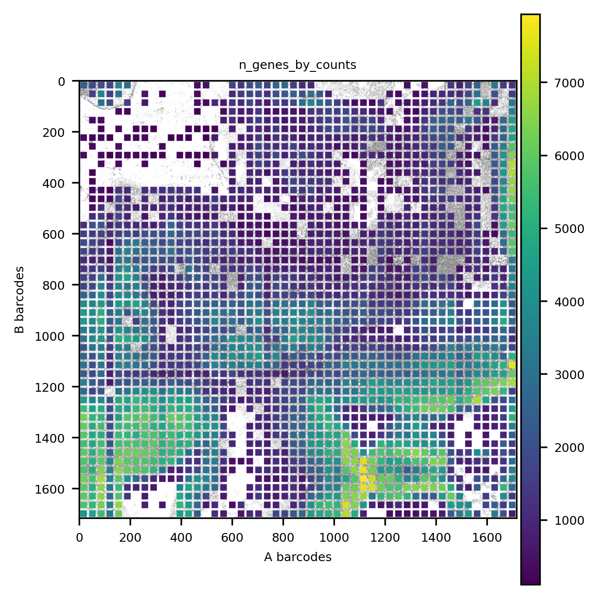
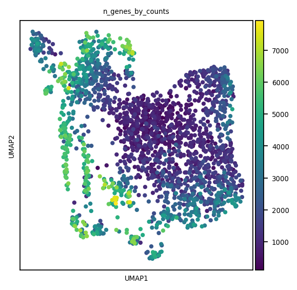
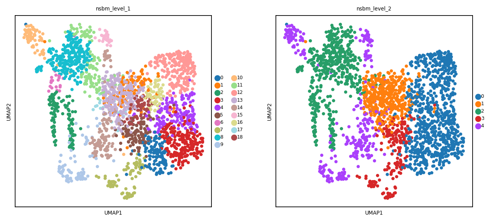
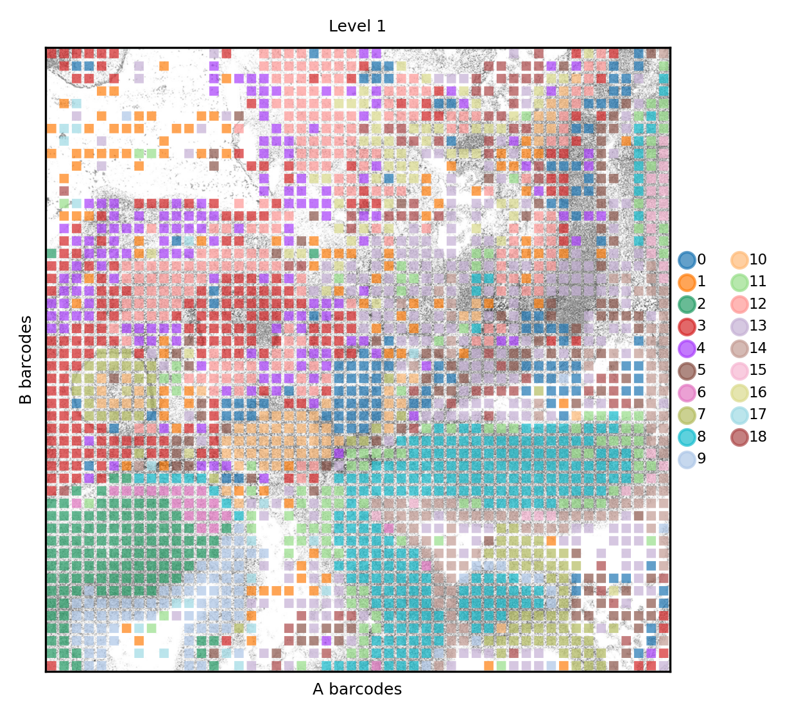
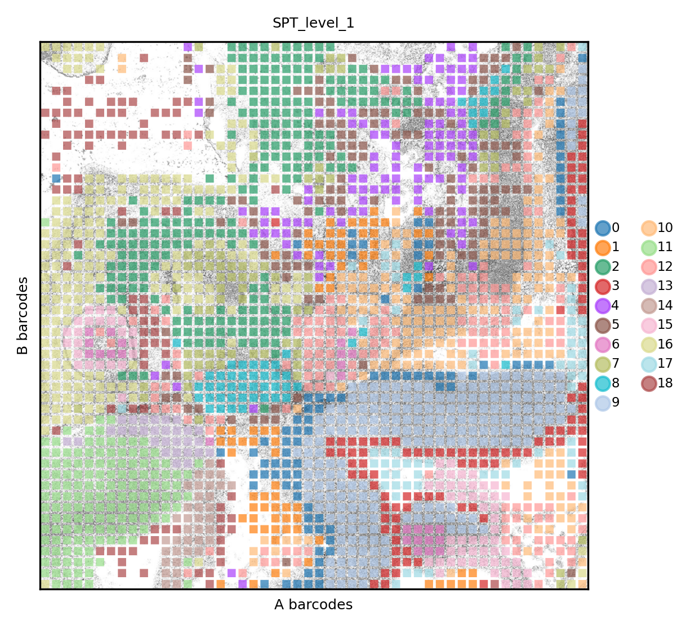

.. _spatial_rna:

===========================================
Analysis of spatially resolved RNA-seq data
===========================================

Similarly to what shown `analyzing ATAC data <../Spatial_ATAC/spatial_atac.html>`_, we retrieved fastq from the paper "**Spatial epigenome–transcriptome co-profiling of mammalian tissues**" (Zhang et al, 2023, DOI:10.1038/s41586-023-05795-1), this time RNA sequences (SRA run ID: SRR22561636) and processed using ``kb_python``. The resulting count matrix file is imported and processed as standard scRNA-seq data

.. code:: python

	import numpy as np
	import pandas as pd
	import matplotlib
	import matplotlib.pyplot as plt
	from matplotlib.pyplot import *
	
	import anndata as ad
	import scanpy as sc
	
	import scipy.sparse as ssp
	import scipy.stats as sst
	
	import spatialdata_io
	import spatialdata_plot
	import spatialdata as sd
	
	import squidpy as sq
	import schist as scs
	import warnings
	warnings.filterwarnings('ignore')
	#import magic
	from tqdm import tqdm
	
	def set_res(high=True):
		dpi=80
		if high:
			dpi=150
		sc.set_figure_params(dpi=dpi, fontsize=6)
		rcParams['axes.grid'] = False
	
	set_res(False)

First we import the ``.h5ad`` file computed by ``kb_python``. After that we perform some QC and filtering, as proposed by sc-best-practices.

.. code:: python

	adata = sc.read_h5ad("SRR22561636/counts_unfiltered/adata.h5ad")

	adata.var["mt"] = adata.var_names.str.startswith("mt-")
	adata.var["ribo"] = adata.var_names.str.startswith(("Rps", "Rpl"))
	sc.pp.calculate_qc_metrics(
		adata, qc_vars=["mt", "ribo"], inplace=True, percent_top=[20], log1p=True
	)
	
	def is_outlier(adata, metric: str, nmads: int):
		M = adata.obs[metric]
		outlier = (M < np.median(M) - nmads * sst.median_abs_deviation(M)) | (
			np.median(M) + nmads * sst.median_abs_deviation(M) < M
		)
		return outlier
	
	adata.obs["outlier"] = (
		is_outlier(adata, "log1p_total_counts", 5)
		| is_outlier(adata, "log1p_n_genes_by_counts", 5)
		| is_outlier(adata, "pct_counts_in_top_20_genes", 5)
	)
	
	
	adata.obs["mt_outlier"] = is_outlier(adata, "pct_counts_mt", 3) | (
		adata.obs["pct_counts_mt"] > 8
	)

In the end we retain most of the pixels

.. code:: python

	print(f"Total number of cells: {adata.n_obs}")
	adata = adata[(~adata.obs.outlier) & (~adata.obs.mt_outlier)].copy()
	print(f"Number of cells after filtering of low quality cells: {adata.n_obs}")

.. code:: parsed-literal

    Total number of cells: 2500
    Number of cells after filtering of low quality cells: 2157

We select highly variable genes and then perform normalization (PFlog1pPF). Lastly, after PCA is computed, we save the ``anndata`` to build later the ``spatialdata`` object.

.. code:: python

	sc.pp.highly_variable_genes(adata,  flavor='seurat_v3_paper')

	pf = adata.X.sum(axis=1).A.ravel()
	l1pf = np.log1p(ssp.diags(pf.mean()/pf)@adata.X)
	pf = l1pf.sum(axis=1).A.ravel()
	adata.X = ssp.diags(pf.mean()/pf)@l1pf

	sc.tl.pca(adata, use_highly_variable=True)
	adata.write("analysis_rna/rna.h5ad")

Here the ``anndata`` is imported using the DBiT-seq plugin for ``spatialdata``. Note that we had to rotate the original image from the paper 90 degrees CCW, as the current version of the plugin orders the barcodes differently from what is displayed in the original paper.

.. code:: python

	spdata = spatialdata_io.readers.dbit.dbit(path='analysis_rna',
	                                     anndata_path='analysis_rna/rna.h5ad',
	                                     barcode_position='barcodes.txt',
	                                     image_path='ME13_50um_spatial/tissue_hires_image.png',
	                                     dataset_id='ME13_50um_spatial')

We can visualize a QC value (number of genes) in its context

.. code:: python
	set_res(True)
	spdata.pl.render_images().pl.render_shapes(color='n_genes_by_counts', fill_alpha=1).pl.show(title='n_genes_by_counts')
	plt.xlabel('A barcodes')
	plt.ylabel('B barcodes')

We create the kNN graph using the PCA embedding, then we apply ``schist`` to find the hierarchical cell structure

.. code:: python
	n_neighbors = 15
	sc.pp.neighbors(spdata.table, 
					metric='cosine',
					key_added='pca_neighbors',
					n_neighbors=n_neighbors, n_pcs=20)

	set_res(False)
	sc.tl.umap(spdata.table, neighbors_key='pca_neighbors')#, min_dist=0.1)
	sc.pl.umap(spdata.table, color=['n_genes_by_counts'])

.. code:: python
	
	basis='pca'
	sc.settings.verbosity=2
	scs.inference.nested_model(spdata.table, 
							   neighbors_key=f'{basis}_neighbors', 
							   dispatch_backend='loky')
	sc.settings.verbosity=0

.. code:: parsed-literal

    minimizing the nested Stochastic Block Model
            minimization step done (0:01:14)
            consensus step done (0:01:25)
        done (0:01:25)
        finished (0:01:25)

.. code:: python

	sc.pl.umap(spdata.table, color=['nsbm_level_1', 'nsbm_level_2'])

Finally we can check how clusters distribute in their spatial context. At level 1 we can distinguish certain clusters that belong to the neual tissues. Here the results appear to be in line with the publication

.. code:: python

	set_res(True)
	spdata.pl.render_images().pl.render_shapes(color='nsbm_level_1', fill_alpha=.7).pl.show(title='Level 1', colorbar=True)
	xticks([])
	yticks([])
	plt.xlabel('A barcodes')
	plt.ylabel('B barcodes')

Similarly to what has been done for ATAC, we perform the analysis of a multimodal data, where one modality is represented by the spatial graph

.. code:: python
	sq.gr.spatial_neighbors(spdata.table, n_neighs=8, coord_type='grid')

	_tmp = spdata.table.copy()
	sc.settings.verbosity=2
	scs.inference.nested_model_multi([spdata.table, _tmp], 
									 key_added='spt', 
									 neighbors_key=['pca_neighbors', 'spatial_neighbors'], 
									 dispatch_backend='loky')
	sc.settings.verbosity=0

.. code:: parsed-literal 

    minimizing the nested Stochastic Block Model
    getting adjacency for data 0 (0:00:00)
    getting adjacency for data 1 (0:00:00)
            minimization step done (0:04:11)
            consensus step done (0:04:21)
        done (0:04:21)
        finished (0:04:22)

Again, we visualize the structured data, with a better resolution of anatomical structures

.. code:: python

	set_res(True)
	spdata.pl.render_images().pl.render_shapes(color='spt_level_1', fill_alpha=.7).pl.show(title='SPT_level_1', colorbar=True)
	xticks([])
	yticks([])
	plt.xlabel('A barcodes')
	plt.ylabel('B barcodes')

    
Again, we save data for later use in `integrated analysis <../Spatial_Multi/spatial_multi.html>`_.

.. code:: python

	spdata.write('analysis/SRR22561636.zarr')

