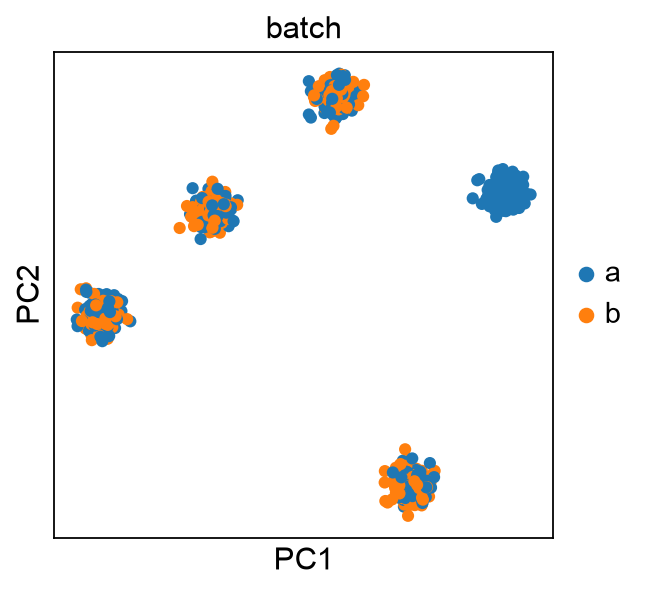
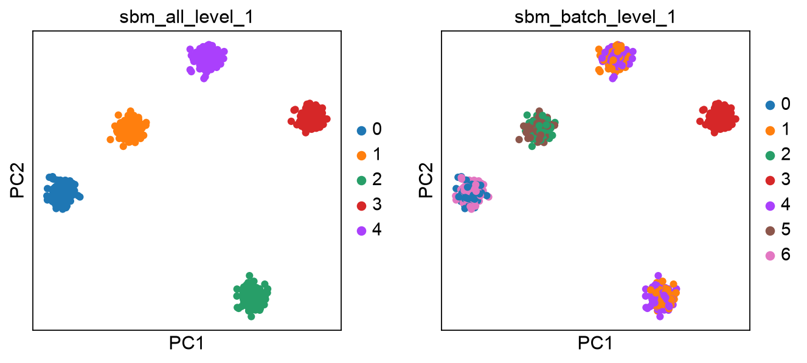

.. _constrained:

==================
Constrained blocks
==================

In some experiments dealing with strict experimental covariates
(e.g. different treatments or samples) it may be desirable to force a
SBM model to group cells with different annotations. In general, a NSBM
is able to identify such covariates directly in the graph, especially if
the covariate information is *encoded* in the data. Nevertheless, it is
possible to specify such covariate to ``schist`` and avoid that cells
having different annotation are grouped together. We exemplify this with
a simple toy dataset

.. code:: ipython3

    import numpy as np
    import scanpy as sc
    import schist as scs
    import pandas as pd
    import matplotlib as mpl
    import matplotlib.pyplot as plt
    from matplotlib.pyplot import *
    %matplotlib inline
    sc.set_figure_params()
    adata = sc.datasets.blobs(n_centers=5, n_variables=20, n_observations=1000, random_state=100, )
    sc.tl.pca(adata)
    sc.pp.neighbors(adata, use_rep='X_pca')

We randomly assign cells to two different batches, a and b. Additionaly,
we assign all cells from one blob to a single batch.

.. code:: ipython3

    adata.obs['batch'] = np.random.choice(['a', 'b'], 1000)
    adata.obs.loc[adata.obs.query('blobs=="0"').index, 'batch'] = 'a'
    sc.pl.pca(adata, color='batch')

First, we fit a default model (nested).

.. code:: ipython3

    sc.settings.verbosity=2
    scs.inference.fit_model(adata, key_added='sbm_all')

.. parsed-literal::

    Minimizing the Model
            done (0:00:02)
    Sampling posterior and getting cell marginals
    100%|████████████████████████████████████████| 100/100 [00:04<00:00, 20.09it/s]
            done (0:00:07)
    Computing the consesus
            done (0:00:07)
        finished (0:00:07)

Then, we fit a model on the same dataset, this time forcing cells from
different batches to be kept apart.

.. code:: ipython3

    scs.inference.fit_model(adata, key_added='sbm_batch', constraint_key='batch')

.. parsed-literal::

    Minimizing the Model
            done (0:00:03)
    Sampling posterior and getting cell marginals
    100%|████████████████████████████████████████| 100/100 [00:02<00:00, 39.15it/s]
            done (0:00:06)
    Computing the consesus
            done (0:00:06)
        finished (0:00:06)

.. code:: ipython3

    sc.pl.pca(adata, color=['sbm_all_level_1', 'sbm_batch_level_1'])

The contingency tables clearly show how the models were fitted. In the
constrained solution, cells from different batches were always
considered in separate groups

.. code:: ipython3

    print(pd.crosstab(adata.obs['batch'], adata.obs['sbm_all_level_1']))

.. parsed-literal:: 

    sbm_all_level_1    0    1    2    3    4
    batch                                   
    a                 98   99   97  200  112
    b                102  101  103    0   88

.. code:: ipython3

    print(pd.crosstab(adata.obs['batch'], adata.obs['sbm_batch_level_1']))

.. parsed-literal::

    sbm_batch_level_1    0    1   2    3    4    5   6
    batch                                             
    a                    0  209  99  200    0    0  98
    b                  102    0   0    0  191  101   0