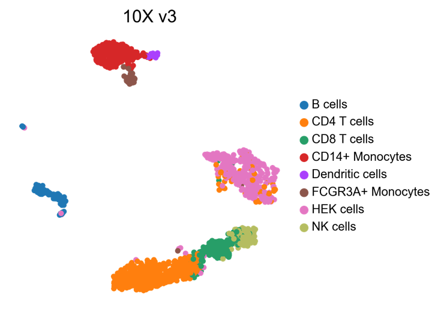
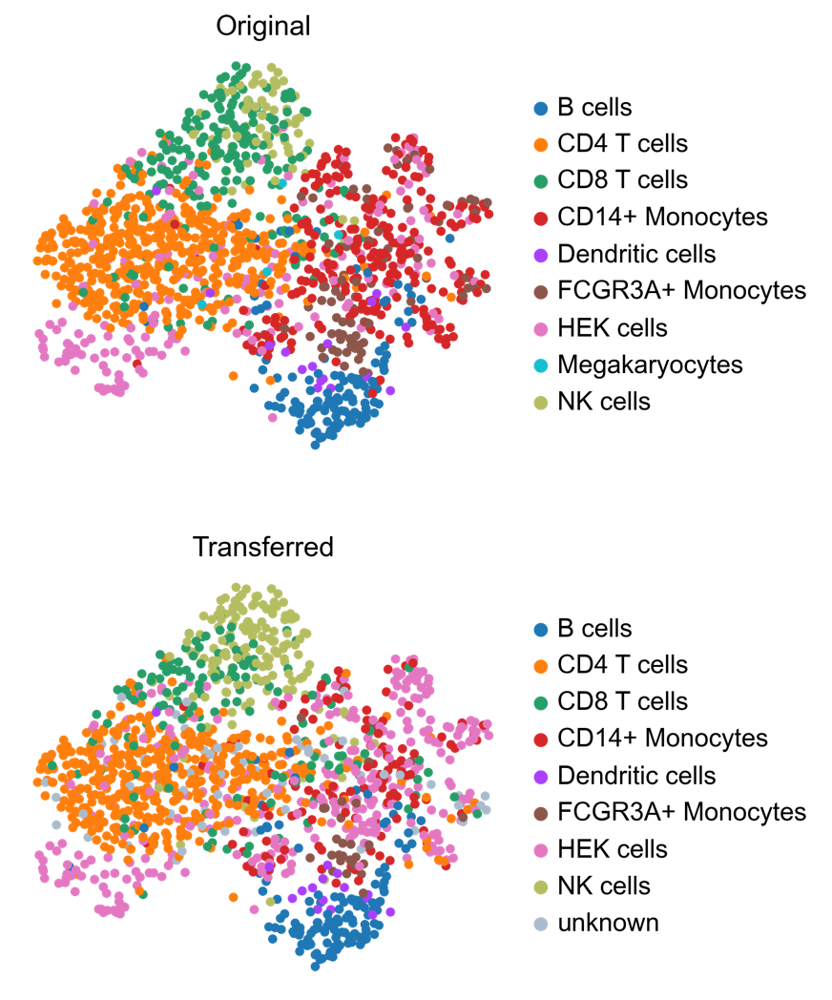
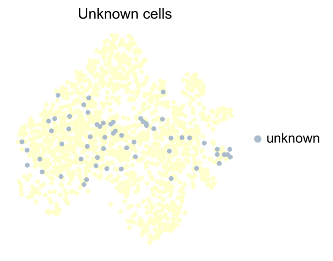
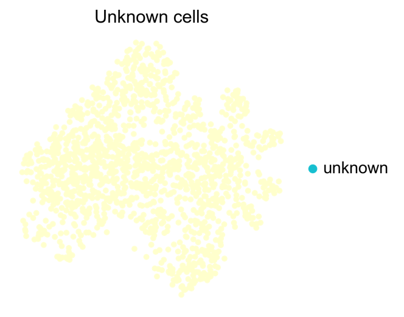
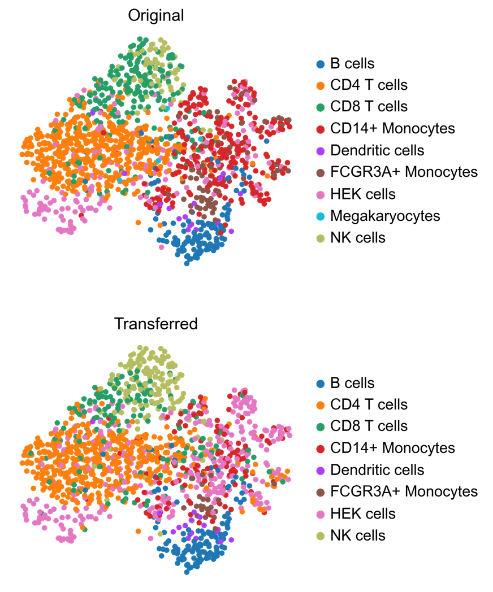

.. _label_transfer:

==============
Label transfer
==============

.. highlight:: python

Differences in **description length** can be used to perform model selection, that is we can choose which model better describes the data. We sought to exploit this property to address the task of annotating cells according to a reference sample. Here, we show an exemple, using data from `Mereu *et al* <https://www.nature.com/articles/s41587-020-0469-4>`_, which includes mixtures of human PBMC and HEK293T cells profiled with various technologies. Cells profiled with 10X V3 platform are used as reference dataset, while annotations are performed on cells profiled with MARS-seq.

First, libraries and datasets are imported::

    import scanpy as sc
    import schist as scs
    import pandas as pd
    import anndata as ad
    adata_10x = sc.read("10XV3_075.h5ad")
    adata_marseq = sc.read("MARSseq_075.h5ad")
    
Let's take a look at UMAP embeddings and cell annotations::

    sc.pl.umap(adata_10x, color='nnet2')
    

   
::  
    
    sc.pl.umap(adata_marsseq, color='nnet2')
    
.. image:: images/MARS-seq_label_tranfer.png
   :height: 300
   :width: 408
   :alt: marsseq_data
    
Current version of ``schist`` (0.7.13) wipes any annotation that is going to be transferred, so we create a copy of the original annotation in the MARS-seq data::

    adata_marsseq.obs['original_nnet2'] = adata_marsseq.obs['nnet2'].copy()
    
After that, cell annotations from 10X V3 can be transfered to MARS-seq dataset simply issuing::

    scs.tl.label_transfer(adata_marseq, adata_10x, obs='nnet2')

Under the hood, ``schist`` first assigns 'unknown' to the ``nnet2`` annotation in MARS-seq data, then both dataset are concatenated and integrated using using `Harmony <https://www.ncbi.nlm.nih.gov/pmc/articles/PMC6884693/>`_.
Cell affinities are calculated using ``scs.tl.calculate_affinity`` function, simulating the moves of each cell to each group: each move generates a variation in the **description length**, which is stored as a probability. This measure evaluates the confidence of cell assignments.
Finally, cells of MARS-seq platform, previoulsy labelled as 'unknown', are reassigned to the group with highest probability. It is important to note that 
Now, the dataset of MARS-seq platform is regenerated and the outcome of label transfer can be visualized::

    sc.pl.umap(adata_marseq, color=['original_nnet2', 'nnet2'], 
               title=['Original', 'Transferred'], ncols=1)
    

In default mode, ``schist`` does not assign a cell to a group if there is not enough evidence for it. Instead, it leaves such cells with the *unknown* label::

    sc.pl.umap(adata_marseq, color='nnet2', groups=['unknown'], na_color='#FFFFCC', 
               frameon=False, title='Unknown cells', na_in_legend=False)
          

There is the possibility to try hard the assignment by using the best label possible, although this may not be optimal::

    scs.tl.label_transfer(adata_marseq, adata_10x, obs='nnet2', use_best=True)
    sc.pl.umap(adata_marseq, color='nnet2', groups=['unknown'], na_color='#FFFFCC', 
          frameon=False, title='Unknown cells', na_in_legend=False)
          

   
As no *unknown* cells are in the dataset, we can safely remove the category and visualize the complete results::

    adata_marseq.obs['nnet2'].cat.remove_unused_categories()
    sc.pl.umap(adata_marseq, color=['original_nnet2', 'nnet2'], frameon=False, 
               ncols=1, title=['Original', 'Transferred'])
              

