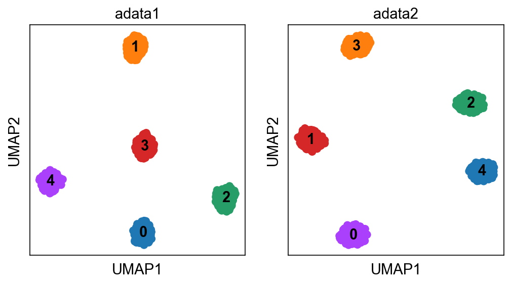
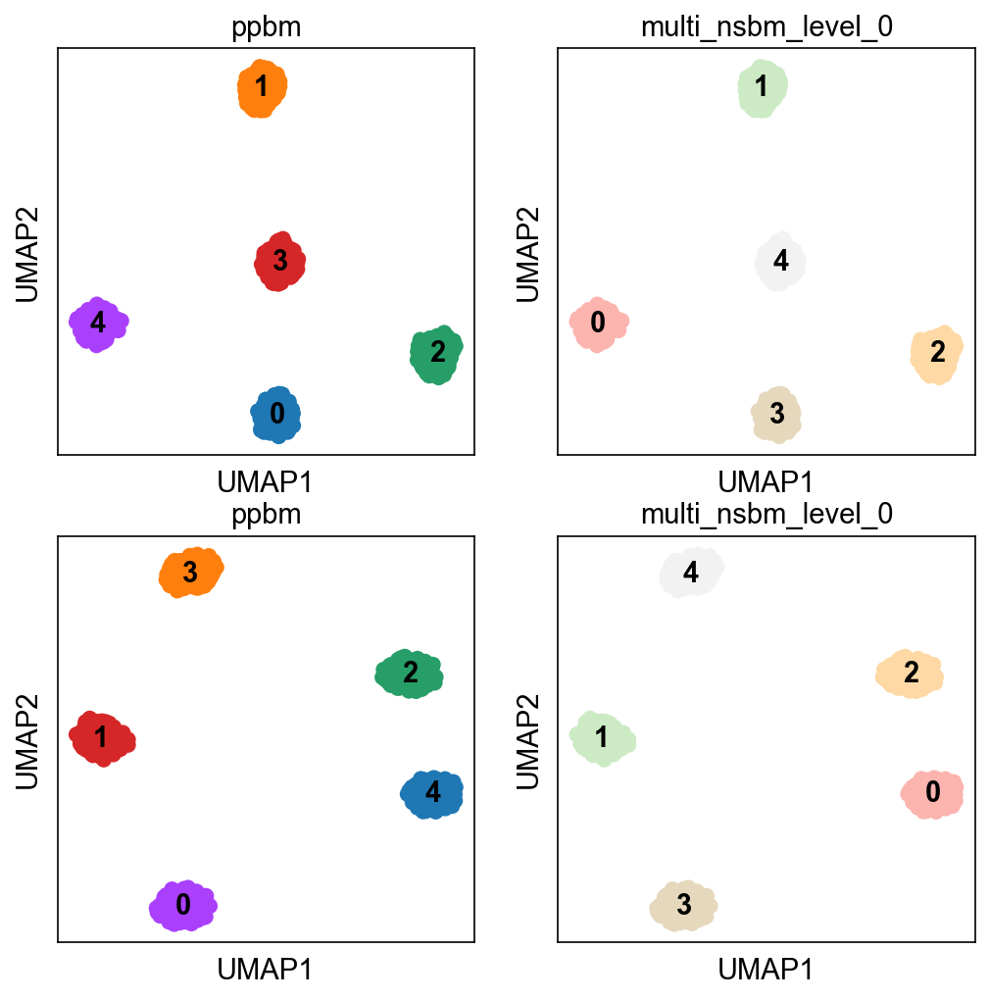

.. _multimodal_data:

===========================
Analysis of multimodal data
===========================

.. highlight:: python

``schist`` can handle multimodal data, `i.e.` scRNA-seq and scATAC-seq data, given that some cells are represented in both datasets. In principle there's no limit to the number of modalities, but there should be no "disjoint" modalitiy. 

Let's take, for example, three datasets (``A``, ``B``, ``C``), the integration only works if all datasets are connected by at least one cell. So, this is a legit case::

   AAAAAAAAAAAAA---------
   ---BBBBB-BBBB-BBBBB---
   -CCCC---C-CCCCC--CCCCC  

This is also a legit case::

   A--A----A----------AAA
   ---BBBBB-BBBB-BBBBB---
   -CCCC---C-CCCCC--CCCCC  

while this is not::

   AAAAAAAAAAAAA---------
   ---BBBBB-BBBB-BBBBB---
   -------------------CCC  

as layer ``C`` is completely disjoint from the other. ``schist`` will provide a solution for this last case, but we expect all cells in layer ``C`` belonging to clusters that are not including cells from ``A`` and ``B``. The correspondence between different datasets is given my matching the cell names.

In this example we will generate two toy datasets with artificial pairings, using the ``scanpy`` blobs::

 import pandas as pd
 import numpy as np
 import scipy.stats as sst
 import schist as scs
 import scanpy as sc
 import matplotlib as mpl
 import matplotlib.pyplot  as plt
 from matplotlib.pyplot import *
 sc.set_figure_params()

 adata1 = sc.datasets.blobs(n_observations=500, n_centers=5, cluster_std=2)
 sc.pp.neighbors(adata1)
 scs.inference.fit_model(adata1, model='ppbm')
 sc.tl.umap(adata1)

``adata1`` will contain 500 cells, 11 features with randomly distributed over 5 clusters. The clusters have been identified using the planted partition model. The paired dataset will contain 500 cells, from the same clusters, but we will change cluster order, so that there's no direct correspondence::

 df = pd.DataFrame(adata1.X)
 df.index = adata1.obs_names
 df['ppbm'] = adata1.obs['ppbm']
 _means = df.groupby('ppbm').describe().filter(like='mean')
 _means2 = _means.sort_index(ascending=False).values
 adata1 = adata1[adata1.obs.sort_values('ppbm').index]
 
Note that adata1 cells have been sorted by cluster name, so that it's easier to build the new dataset::

 adata2 = adata1.copy()
 adata2.X = np.vstack([np.array([sst.norm(_means2[y, x]).rvs(100) for x in range(11)]).T for y in range(5)])
 sc.pp.neighbors(adata2)
 sc.tl.umap(adata2)
 adata2.uns['ppbm_colors']  = adata2.uns['ppbm_colors'][::-1]
 
In the last line we reversed colors for ppbm clusters, so that it's easy to spot the parings in the embeddings::

 fig = figure(figsize=(8, 4))
 ax = fig.add_subplot(1, 2, 1)
 sc.pl.umap(adata1, color='ppbm', show=False, ax=ax, legend_loc='on data', title='adata1)
 ax = fig.add_subplot(1, 2, 2)
 sc.pl.umap(adata2, color='ppbm', show=False, ax=ax, legend_loc='on data', title='adata2')

In these two datasets pairings can be appreciated by colors, only cluster 2 has not been changed. At this point we can apply the multimodal nested model::

 scs.inference.moodel_multi([adata1, adata2])

Note that ``schist`` does not support (yet) actual multimodal data structures (such as ``MuData``), so different layers should be provided in a list of ``AnnData`` objects. The datasets will be annotated with clusters consistent across datasets::

 fig = figure(figsize=(8, 8))
 ax = fig.add_subplot(2, 2, 1)
 sc.pl.umap(adata1, color='ppbm', legend_loc='on data', ax=ax, show=False)
 ax = fig.add_subplot(2, 2, 2)
 sc.pl.umap(adata1, color='multi_nsbm_level_0', legend_loc='on data', ax=ax, show=False)
 ax = fig.add_subplot(2, 2, 3)
 sc.pl.umap(adata2, color='ppbm', legend_loc='on data', ax=ax, show=False)
 ax = fig.add_subplot(2, 2, 4)
 sc.pl.umap(adata2, color='multi_nsbm_level_0', legend_loc='on data', ax=ax, show=False, color_map='Pastel2')

The new clustering scheme is now consistent across datasets.