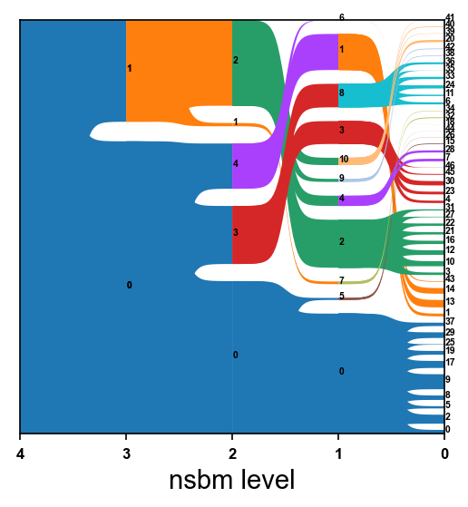
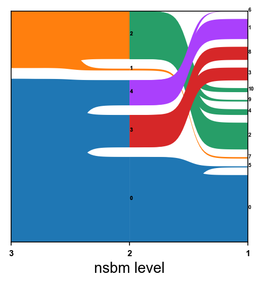
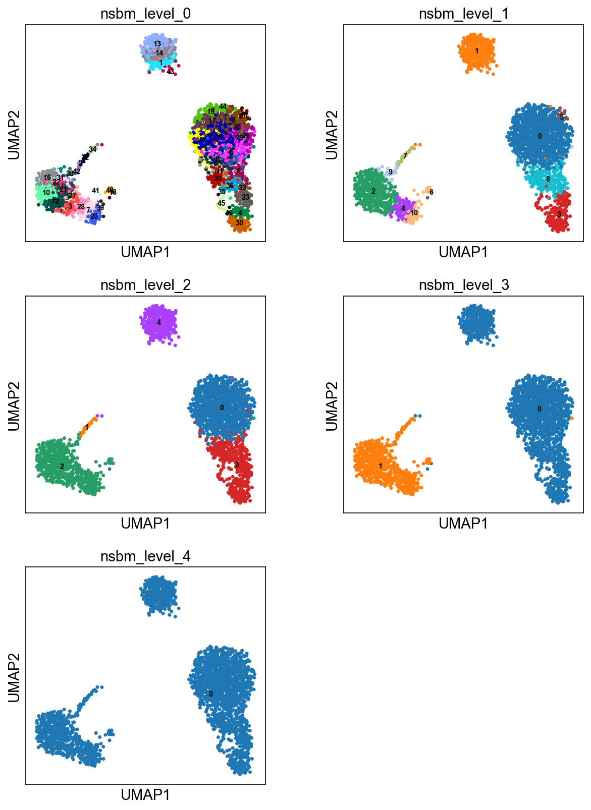

=========
Tutorials
=========

.. highlight:: python

In ored to perform cluster analysis on single cell data, count matrices must be previously prepared for the analysis. For a brief and effective example of single cell RNA sequencing (scRNA-seq) data processing, check the `Scanpy tutorial of 3k PBMCs <https://scanpy-tutorials.readthedocs.io/en/latest/pbmc3k.html>`_.

----------------------
Clustering of 3k PBMCs
----------------------

In this section, the "3k PBMCs" dataset is preprocessed, using ``scanpy``. Afterwards, cluster analysis is performed, using ``schist``. 

The first step necessary to perform cluster analyses with ``schist`` is to import the library::
    
    import schist as scs

After that, standard analysis with ``scanpy`` can be performed::
    
    import scanpy as sc
    
    adata=sc.read(adata = sc.read_10x_mtx('data/filtered_gene_bc_matrices/hg19/', var_names='gene_symbols', cache=True)  
    sc.pp.filter_cells(adata, min_genes=200)
    sc.pp.filter_genes(adata, min_cells=3)
    mito_genes = adata.var_names.str.startswith('MT-') 
    adata.obs['percent_mito'] = np.sum(adata[:, mito_genes].X, axis=1) / np.sum(adata.X, axis=1)
    adata.obs['n_counts'] = adata.X.sum(axis=1)
    adata = adata[adata.obs['percent_mito'] < 0.05, :]
    sc.pp.normalize_total(adata, target_sum=1e4)
    sc.pp.log1p(adata)
    sc.pp.highly_variable_genes(adata, min_mean=0.05, max_mean=3, min_disp=0.5)
    adata = adata[:, adata.var.highly_variable]
    sc.pp.regress_out(adata, ['n_counts', 'percent_mito'])
    sc.pp.scale(adata, max_value=10)
    sc.tl.pca(adata)

Before the cluster analysis with ``schist``, the *k*\-NN graph must be built, representing connections between cells of the dataset. The *k*\-NN graph can be created, using the scanpy function ``sc.pp.neighbors()``, which allows the selection of the number of neighbors and the number of pca components considered for the analysis::

    sc.pp.neighbors(adata, n_neighbors=20, n_pcs=30)

Moreover, in order to spatially visualize the outcome of cluster analysis, we can compute the UMAP embedding of our dataset, using the function ``sc.tl.umap()``::
   
    sc.tl.umap(adata)

nested_model
^^^^^^^^^^^^

The most prominent function implemented in ``schist`` library is the clustering function ``schist.inference.nested_model()``. It relies on a process called *minimization of the description length*\, which is implemented in the `graph-tool python library <https://graph-tool.skewed.de/>`_:
    
    - in lay terms, different partitions representig the dataset are generated; 
    - after that, the partition with the *lowest description* length is selected as the final output (the simplest partition among partitions with the highest explanatory power).

However, the *minimization of the description length* could fall into local minima. Therefore, another approach has been implemented in ``graph-tool``: 
    
    - in particular, the *minimization step* can be called multiple times;
    - the partition with the lowest description lenght is stored for each round of *minimization*;
    - finally, each stored partition is explored, in order to build a single partition, which considers each minimum.

Pratically, this can be achieved, using ``schist``::

    scs.inference.nested_model(adata, samples=100)
    
The parameter ``samples`` accounts for the number of minimization step performed: the larger the number of rounds, the slower the process. ``samples`` parameter is set at 100 by default.

In order to effectively visualize the nested hierarchy representing the partition, we have implemented the function ``schist.plotting.alluvial()``::

    scs.plotting.alluvial(adata)
    

The hierarchy can be furtherly cut, using the parameters ``level_start`` and ``level_end``::

    scs.plotting.alluvial(adata, level_start=1, level_end=3)
    

The final outcome of the function ``schist.inference.nested_model()`` consists of a series of nested levels, stored in ``adata.obs``, with the prefix ``nsbm_level_`` followed by a number, expressing the level of the hierarchy. Each level can be visualized thanks to the ``scanpy`` function ``sc.pl.umap``::

    sc.pl.umap(adata, color=['nsbm_level_0', 'nsbm_level_1', 'nsbm_level_2', 'nsbm_level_3', 'nsbm_level_4'], ncols=2, legend_loc='on data')

planted_model
^^^^^^^^^^^^^

spiego planted

codice planted

esito planted

--------------
Label transfer
--------------

spiego label transfer (problema)
spiego come lo faccio (cell aff)
spiego cosa mi serve (harmony)

mostro codice

mostro outcome con dati buoni (quartzseq)

mostro outcome con dati non buoni (iCEll8)
