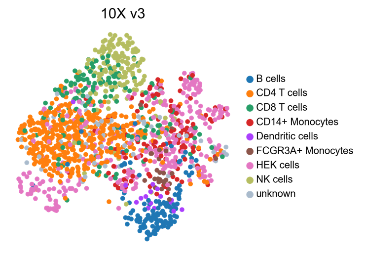

=========
Tutorials
=========

.. highlight:: python

In ored to perform cluster analysis on single cell data, count matrices must be previously prepared for the analysis. For a brief and effective example of single cell RNA sequencing (scRNA-seq) data processing, check the `Scanpy tutorial of 3k PBMCs <https://scanpy-tutorials.readthedocs.io/en/latest/pbmc3k.html>`_.

----------------------
Clustering of 3k PBMCs
----------------------

In this section, the "3k PBMCs" dataset is preprocessed, using ``scanpy``. Afterwards, cluster analysis is performed, using ``schist``. 

The first step necessary to perform cluster analyses with ``schist`` is to import the library::
    
    import schist as scs

After that, standard analysis with ``scanpy`` can be performed::
    
    import scanpy as sc
    
    adata=sc.read(adata = sc.read_10x_mtx('data/filtered_gene_bc_matrices/hg19/', var_names='gene_symbols', cache=True)  
    sc.pp.filter_cells(adata, min_genes=200)
    sc.pp.filter_genes(adata, min_cells=3)
    mito_genes = adata.var_names.str.startswith('MT-') 
    adata.obs['percent_mito'] = np.sum(adata[:, mito_genes].X, axis=1) / np.sum(adata.X, axis=1)
    adata.obs['n_counts'] = adata.X.sum(axis=1)
    adata = adata[adata.obs['percent_mito'] < 0.05, :]
    sc.pp.normalize_total(adata, target_sum=1e4)
    sc.pp.log1p(adata)
    sc.pp.highly_variable_genes(adata, min_mean=0.05, max_mean=3, min_disp=0.5)
    adata = adata[:, adata.var.highly_variable]
    sc.pp.regress_out(adata, ['n_counts', 'percent_mito'])
    sc.pp.scale(adata, max_value=10)
    sc.tl.pca(adata)

Before the cluster analysis with ``schist``, the *k*\-NN graph must be built, representing connections between cells of the dataset. The *k*\-NN graph can be created, using the scanpy function ``sc.pp.neighbors()``, which allows the selection of the number of neighbors and the number of pca components considered for the analysis::

    sc.pp.neighbors(adata, n_neighbors=20, n_pcs=30)

Moreover, in order to spatially visualize the outcome of cluster analysis, we can compute the UMAP embedding of our dataset, using the function ``sc.tl.umap()``::
   
    sc.tl.umap(adata)

nested_model
^^^^^^^^^^^^

The most prominent function implemented in ``schist`` library is the clustering function ``schist.inference.nested_model()``. It relies on a process called *minimization of the description length*\, implemented in the `graph-tool python library <https://graph-tool.skewed.de/>`_:
    
    - in lay terms, different partitions representig the dataset are generated; 
    - after that, the partition with the *lowest description* length is selected as the final output (the simplest partition among partitions with the highest explanatory power).

However, the *minimization of the description length* could fall into local minima. Therefore, another approach has been implemented in ``graph-tool``: 
    
    - in particular, the *minimization step* can be called multiple times;
    - the partition with the lowest description lenght is stored for each round of *minimization*;
    - finally, each stored partition is explored, in order to build a single partition, which considers each minimum.

Pratically, this can be achieved, using ``schist``::

    scs.inference.nested_model(adata, samples=100)
    
The parameter ``samples`` accounts for the number of minimization step performed: the larger the number of rounds, the slower the process. ``samples`` parameter is set at 100 by default.

In order to effectively visualize the nested hierarchy representing the partition, we have implemented the function ``schist.plotting.alluvial()``::

    scs.plotting.alluvial(adata)
    

The hierarchy can be furtherly cut, using the parameters ``level_start`` and ``level_end``::

    scs.plotting.alluvial(adata, level_start=1, level_end=3)
    

The final outcome of the function ``schist.inference.nested_model()`` consists of a series of nested levels, stored in ``adata.obs``, with the prefix ``nsbm_level_`` followed by a number, expressing the level of the hierarchy. Each level can be visualized thanks to the ``scanpy`` function ``sc.pl.umap()``::

    sc.pl.umap(adata, color=['nsbm_level_0', 'nsbm_level_1', 'nsbm_level_2', 'nsbm_level_3', 'nsbm_level_4'], ncols=2, legend_loc='on data')

.. image:: images/nested_model.png
   :height: 900
   :width: 656
   :alt: nested_model

planted_model
^^^^^^^^^^^^^

The function ``nested_model()`` is expected to find reliable communities in networks, however, it pays its statistical significance in terms of runtimes. Another approach implemented in ``graph-tool``, called Planted Partition Block Model, performs Bayesian inference on node groups. This function, in particular, uses the Planted Block Model, which is particularly suitable in case of assortative graphs and it returns the optimal number of communities::

    scs.inference.planted_model(adata)

The final outcome of the function ``schist.inference.planted_model()`` consists of a single layer of annotations, stored in ``adata.obs``, with the prefix ``ppbm``, which can be visualized through ``sc.pl.umap()``::

    sc.pl.umap(adata, color=['ppbm'], legend_loc='on data')

.. image:: images/planted_model.png
   :height: 300
   :width: 288
   :alt: planted_model

--------------
Label transfer
--------------

Differences in **description length** can be used to perform model selection, that is we can choose which model better describes the data. We sought to exploit this property to address the task of annotating cells according to a reference sample. Here, we show an exemple, using data from `Mereu *et al* <https://www.nature.com/articles/s41587-020-0469-4>`_, which includes mixtures of human PBMC and HEK293T cells profiled with various technologies. Cells profiled with 10X V3 platform are used as reference dataset, while annotations are performed on cells profiled with MARS-seq.

First, libraries and datasets are imported::

    import scanpy as sc
    import schist as scs
    import pandas as pd
    import anndata as ad
    adata_10x = sc.read("10XV3_075.h5ad")
    adata_marseq = sc.read("MARSseq_075.h5ad")
    
Let's take a look at UMAP embeddings and cell annotations::

    sc.pl.umap(adata_10x, color='nnet2')
    
.. image:: images/10x_label_transfer.png
   :height: 300
   :width: 407
   :alt: 10x_data
   
::  
    
    sc.pl.umap(adata_marsseq, color='nnet2')
    

    
Current version of ``schist`` (0.7.13) wipes any annotation that is going to be transferred, so we create a copy of the original annotation in the MARS-seq data::

    adata_marsseq.obs['original_nnet2'] = adata_marsseq.obs['nnet2'].copy()
    
After that, cell annotations from 10X V3 can be transfered to MARS-seq dataset simply issuing::

    scs.tl.label_transfer(adata_marseq, adata_10x, obs='nnet2')

Under the hood, ``schist`` first assigns 'unknown' to the ``nnet2`` annotation in MARS-seq data, then both dataset are concatenated and integrated using using `Harmony <https://www.ncbi.nlm.nih.gov/pmc/articles/PMC6884693/>`_.
Cell affinities are calculated using ``scs.tl.calculate_affinity`` function, simulating the moves of each cell to each group: each move generates a variation in the **description length**, which is stored as a probability. This measure evaluates the confidence of cell assignments.
Finally, cells of MARS-seq platform, previoulsy labelled as 'unknown', are reassigned to the group with highest probability. It is important to note that 
Now, the dataset of MARS-seq platform is regenerated and the outcome of label transfer can be visualized::

    sc.pl.umap(adata_marseq, color=['original_nnet2', 'nnet2'], 
               title=['Original', 'Transferred'], ncols=1)
    
.. image:: images/label_transfer_outcome.png
   :height: 489
   :width: 407
   :alt: label_transfer

In default mode, ``schist`` does not assign a cell to a group if there is not enough evidence for it. Instead, it leaves such cells with the *unknown* label::

    sc.pl.umap(adata_marseq, color='nnet2', groups=['unknown'], na_color='#FFFFCC', 
               frameon=False, title='Unknown cells', na_in_legend=False)
          
.. image:: images/label_transfer_unknown.png
   :height: 300
   :width: 383
   :alt: label_unknown

There is the possibility to try hard the assignment by using the best label possible, although this may not be optimal::

    scs.tl.label_transfer(adata_marseq, adata_10x, obs='nnet2', use_best=True)
    sc.pl.umap(adata_marseq, color='nnet2', groups=['unknown'], na_color='#FFFFCC', 
          frameon=False, title='Unknown cells', na_in_legend=False)
          
.. image:: images/label_transfer_unknown_best.png
   :height: 300
   :width: 383
   :alt: label_unknown_best
   
As no *unknown* cells are in the dataset, we can safely remove the category and visualize the complete results::

    adata_marseq.obs['nnet2'].cat.remove_unused_categories()
    sc.pl.umap(adata2, color=['original_nnet2', 'nnet2'], frameon=False, 
               ncols=1, title=['Original', 'Transferred'])
              
.. image:: images/label_transfer_outcome_best.png
   :height: 489
   :width: 407
   :alt: label_transfer_best

